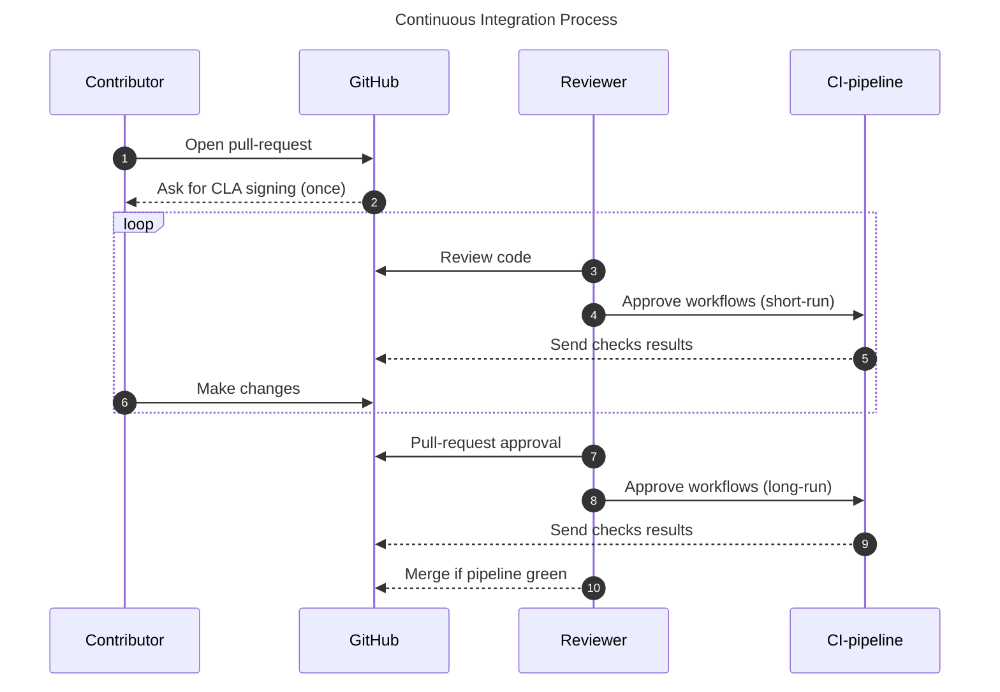

# Contributing to TFHE-rs

This document provides guidance on how to contribute to **TFHE-rs**.

There are two ways to contribute:

- **Report issues:** Open issues on GitHub to report bugs, suggest improvements, or note typos.
- **Submit code**: To become an official contributor, you must sign our Contributor License Agreement (CLA). Our CLA-bot will guide you through this process when you open your first pull request.

## 1. Setting up the project

Start by [forking](https://docs.github.com/en/pull-requests/collaborating-with-pull-requests/working-with-forks/fork-a-repo) the **TFHE-rs** repository.


- **Rust version**:  Ensure that you use a Rust version >= 1.81 to compile **TFHE-rs**.
- **Incompatibility**: AArch64-based machines are not yet supported for Windows as it's currently missing an entropy source to be able to seed the [CSPRNGs](https://en.wikipedia.org/wiki/Cryptographically_secure_pseudorandom_number_generator) used in **TFHE-rs**.
- **Performance**: For optimal performance, it is highly recommended to run **TFHE-rs** code in release mode with cargo's `--release` flag.


To get more details about the library, please refer to the [documentation](https://docs.zama.org/tfhe-rs).

## 2. Creating a new branch

When creating your branch, make sure to use the following format :

```
git checkout -b {feat|fix|docs|chore…}/short_description
```

For example:

```
git checkout -b feat/new_feature_X
```

## 3. Before committing

### 3.1 Linting

Each commit to **TFHE-rs** should conform to the standards of the project. In particular, every source code, docker or workflows files should be linted to prevent programmatic and stylistic errors.

- Rust source code linters: `clippy`
- Typescript/Javascript source code linters: `eslint`, `prettier`

To apply automatic code formatting, run:

```
make fmt
```

You can perform linting of all Cargo targets with:

```
make clippy_all_targets
```

### 3.2 Testing

Your contributions must include comprehensive documentation and tests without breaking existing tests. To run pre-commit checks, execute:

```
make pcc
```

This command ensure that all the targets in the library are building correctly.
For a faster check, use:

```
make fpcc
```

If you're contributing to GPU code, run also:

```
make pcc_gpu
```

Unit testing suites are heavy and can require a lot of computing power and RAM availability.
Whilst tests are run automatically in continuous integration pipeline, you can run tests locally.

All unit tests have a command formatted as:

```
make test_*
```

Run `make help` to display a list of all the commands available.

To quickly test your changes locally, follow these steps:
 1. Locate where the code has changed.
 2. Add (or modify) a Cargo test filter to the corresponding `make` target in Makefile.
 3. Run the target.


`make test_<something>` will print the underlying cargo command in STDOUT. You can quickly test your changes by copy/pasting the command and then modify it to suit your needs.


For example, if you made changes in `tfhe/src/integer/*`, you can test them with the following steps:
 1. In `test_integer` target, replace the filter `-- integer::` by `-- my_new_test`.
 2. Run `make test_integer`.

## 4. Committing

**TFHE-rs** follows the conventional commit specification to maintain a consistent commit history, essential for Semantic Versioning ([semver.org](https://semver.org/)).
Commit messages are automatically checked in CI and will be rejected if they do not comply, so make sure that you follow the commit conventions detailed on [this page](https://www.conventionalcommits.org/en/v1.0.0/).

## 5. Rebasing

Before creating a pull request, rebase your branch on the repository's `main` branch. Merge commits are not permitted, thus rebasing ensures fewer conflicts and a smoother PR review process.

## 6. Opening a Pull Request

Once your changes are ready, open a Pull Request. (Refer to GitHub's [official documentation](https://docs.github.com/en/pull-requests/collaborating-with-pull-requests/proposing-changes-to-your-work-with-pull-requests/creating-a-pull-request-from-a-fork).)

Before requesting a review, please ensure your work compiles and runs as intended. Note that reviewers are not responsible for guiding contributors through code debugging.

### Guidelines about AI usage

At Zama, we believe that human reasoning, critical thinking, and authentic communication during development could bring more value than LLMs.

We therefore expect contributors to follow these guidelines when using AI:

1. **Clearly disclose AI assistance** in your PR description. For example:
    > "I consulted ChatGPT to understand part of the codebase, but the implementation was written manually by me."

    >  "This PR includes code suggestions generated by Claude Code, which I reviewed, modified, and validated."

  - Please note:
    - Pull Requests that include AI-generated code **without clear disclosure and human review** will not be accepted
    - You must be able to **explain and justify** every part of the submitted code.
    - The final contribution must reflect **your own reasoning, understanding, and design decisions**.

2.  Avoid lengthy or wordy AI-generated texts:
  - Use AIs for inspirations but never let them speak for you 100%.
  - We recommend writing your own GitHub issues, comments, and PR descriptions. Perfect grammar is not required, authenticity is valued more than polish.

Respecting these guidelines shows respect for the community and ensures efficient and valuable contributions.

## 7. Continuous integration

Before a pull request can be merged, several test suites run automatically. Below is an overview of the CI process:





## Useful details:

- pipeline is triggered by humans
- review team is located in Paris timezone, pipeline launch will most likely happen during office hours
- direct changes to CI related files are not allowed for external contributors
- run `make pcc` to fix any build errors before pushing commits


## 8. Data versioning

Data serialized with TFHE-rs must remain backward compatible. This is done using the [tfhe-versionable](https://crates.io/crates/tfhe-versionable) crate.

If you modify a type that derives `Versionize` in a backward-incompatible way, an upgrade implementation must be provided.

For example, these changes are data breaking:
 * Adding a field to a struct.
 * Changing the order of the fields within a struct or the variants within an enum.
 * Renaming a field of a struct or a variant of an enum.
 * Changing the type of field in a struct or a variant in an enum.

On the contrary, these changes are *not* data breaking:
 * Renaming a type (unless it implements the `Named` trait).
 * Adding a variant to the end of an enum.

Historical data from previous TFHE-rs versions are stored inside `utils/tfhe-backward-compat-data`. They are used to check on every PR that backward compatibility has been preserved.

## Example: adding a field

Suppose you want to add an i32 field to a type named `MyType`. The original type is defined as:
```rust
#[derive(Serialize, Deserialize, Versionize)]
#[versionize(MyTypeVersions)]
struct MyType {
  val: u64,
}
```
And you want to change it to:
```rust
#[derive(Serialize, Deserialize, Versionize)]
#[versionize(MyTypeVersions)]
struct MyType {
  val: u64,
  other_val: i32
}
```

Follow these steps:

 1. Navigate to the definition of the dispatch enum of this type. This is the type inside the `#[versionize(MyTypeVersions)]` macro attribute. In general, this type has the same name as the base type with a `Versions` suffix. You should find something like

```rust
#[derive(VersionsDispatch)]
enum MyTypeVersions {
  V0(MyTypeV0),
  V1(MyType)
}
```

 2. Add a new variant to the enum to preserve the previous version of the type. You can simply copy and paste the previous definition of the type and add a version suffix:

```rust
#[derive(Version)]
struct MyTypeV1 {
  val: u64,
}

#[derive(VersionsDispatch)]
enum MyTypeVersions {
  V0(MyTypeV0),
  V1(MyTypeV1),
  V2(MyType) // Here this points to your modified type
}
```

 3. Implement the `Upgrade` trait to define how we should go from the previous version to the current version:
```rust
impl Upgrade<MyType> for MyTypeV1 {
  type Error = Infallible;

   fn upgrade(self) -> Result<MyType, Self::Error> {
       Ok(MyType {
           val: self.val,
           other_val: 0
        })
   }
}
```

 4. Fix the upgrade target of the previous version. In this example, `impl Upgrade<MyType> for MyTypeV0 {` should simply be changed to `impl Upgrade<MyTypeV1> for MyTypeV0 {`
