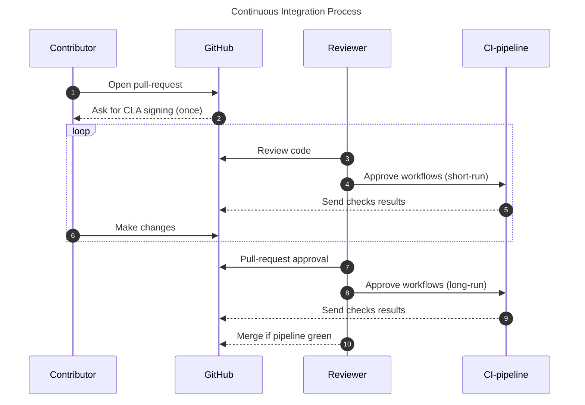

# Contributing to TFHE-rs

There are two ways to contribute to **TFHE-rs**:

- You can open issues to report bugs, typos and suggest ideas.
- You can become an official contributor, but you need to sign our Contributor License Agreement (CLA) on your first contribution. Our CLA-bot will guide you through the process when you will open a Pull Request on GitHub.

## 1. Setting up the project

You need to [fork](https://docs.github.com/en/pull-requests/collaborating-with-pull-requests/working-with-forks/fork-a-repo) the **TFHE-rs** repository.

> [!Note]
> You need to use a Rust version >= 1.81 to compile **TFHE-rs**.

> [!Note]
> aarch64-based machines are not yet supported for Windows as it's currently missing an entropy source to be able to seed the [CSPRNGs](https://en.wikipedia.org/wiki/Cryptographically_secure_pseudorandom_number_generator) used in **TFHE-rs**.

> [!Important]
> **Performance**: for optimal performance, it is highly recommended to run **TFHE-rs** code in release mode with cargo's `--release` flag.

To get more details about the library, please refer to the [documentation](https://docs.zama.ai/tfhe-rs).

## 2. Creating a new branch

When creating your branch, make sure to use the following format :

```
git checkout -b {feat|fix|docs|chore…}/short_description
```

For example:

```
git checkout -b feat/new_feature_X
```

## 3. Before committing

### 3.1 Linting

Each commit to **TFHE-rs** should conform to the standards of the project. In particular, every source code, docker or workflows files should be linted to prevent programmatic and stylistic errors.

- Rust source code linters: `clippy`
- typescript/javascript source code linters: `eslint`, `prettier`

To apply automatic code formatting run:

```
make fmt
```

Linting of all Cargo targets can be done with:

```
make clippy_all_targets
```

### 3.2 Testing

Your code must be well documented, provide extensive tests if any feature has been added and must not break other tests.

To execute pre-commit checks, please run the following command:

```
make pcc
```

This command ensure that all the targets in the library are building correctly.
Alternatively, you might want to run a faster version of this command using:

```
make fpcc
```

If you're contributing to GPU code, you would want to run also:

```
make pcc_gpu
```

Unit testing suites are heavy and can require a lot of computing power and RAM availability.
Whilst tests are run automatically in continuous integration pipeline, you can run test locally.

All unit tests have a command formatted as:

```
make test_*
```

Run `make help` to display a list of all the commands available.

To quickly test your changes locally:
 * locate where the code has changed
 * add (or modify) a Cargo test filter to the corresponding `make` target in Makefile
 * run the target


`make test_<something>` will print the underlying cargo command in STDOUT. Changes can be quickly tested by copy/paste the command and then modify it to suit your needs.


For example, if you made changes in `tfhe/src/integer/*`:
 * replace, in `test_integer` target, the filter `-- integer::` by `-- my_new_test`
 * run `make test_integer`

## 4. Committing

**TFHE-rs** follows conventional commit specification to have a consistent commit naming scheme and you are expected to follow it as well.

This is a mandatory requirement for Semantic Versioning ([https://semver.org/](https://semver.org/)) used in **TFHE-rs** release process to define the version number and create automatically meaningful changelog.

Just a reminder that commit messages are checked automatically in the CI and are rejected if they don't follow the rules. To learn more about conventional commits, check [this page](https://www.conventionalcommits.org/en/v1.0.0/).

## 5. Rebasing

You should rebase on top of the repository's `main` branch before you create your pull request. Merge commits are not allowed, so rebasing on `main` before pushing gives you the best chance of to avoid rewriting parts of your PR later if conflicts arise with other PRs being merged.

## 6. Open a pull-request

You can now open a pull-request. For more details on how to do so from a forked repository, please read GitHub's [official documentation](https://docs.github.com/en/pull-requests/collaborating-with-pull-requests/proposing-changes-to-your-work-with-pull-requests/creating-a-pull-request-from-a-fork) on the subject.

## 7. Continuous Integration

Several tests suites are executed automatically before being able to merge a pull-request.




> [!Note]
>Useful details:
>* pipeline is triggered by humans
>* review team is located in Paris timezone, pipeline launch will most likely happen during office hours
>* direct changes to CI related files are not allowed for external contributors
>* run `make pcc` to fix any build errors before pushing commits

## 8. Data versioning

Data serialized with **TFHE-rs** should be backward compatible. This is done with the [tfhe-versionable](https://crates.io/crates/tfhe-versionable) crate.
If you modify a type that derives `Versionize` in a way that is not backward compatible, you should add an upgrade to that type.

For example, these changes are data breaking:
- Adding a field to a struct,
- changing the order of the fields within a struct or the variants within an enum,
- renaming a field of a struct or a variant of an enum,
- changing the type of field in a struct or a variant in an enum.

On the contrary, these changes are *not* data breaking:
- Renaming a type (though if it implements the `Named` trait, it can be),
- adding a variant to the end of an enum

Here is a quick example of how to do this.
Suppose you want to add a new i32 field to a type named `MyType`.

For example, you want to change this:
```rust
#[derive(Serialize, Deserialize, Versionize)]
#[versionize(MyTypeVersions)]
struct MyType {
  val: u64,
}
```
into this:
```rust
#[derive(Serialize, Deserialize, Versionize)]
#[versionize(MyTypeVersions)]
struct MyType {
  val: u64,
  other_val: i32
}
```

1. Navigate to the definition of the dispatch enum of this type. This is the type inside the `#[versionize(MyTypeVersions)]` macro attribute. In general, this type has the same name as the base type with a `Versions` suffix. You should find something like

```rust
#[derive(VersionsDispatch)]
enum MyTypeVersions {
  V0(MyTypeV0),
  V1(MyType)
}
```

2. Add a new variant to the enum to preserve the previous version of the type. You can simply copy and paste the previous definition of the type and add a version suffix:

```rust
#[derive(Version)]
struct MyTypeV1 {
  val: u64,
}

#[derive(VersionsDispatch)]
enum MyTypeVersions {
  V0(MyTypeV0),
  V1(MyTypeV1),
  V2(MyType) // Here this points to your modified type
}
```

3. Implement the `Upgrade` trait to define how we should go from the previous version to the current version:
```rust
impl Upgrade<MyType> for MyTypeV1 {
  type Error = Infallible;

   fn upgrade(self) -> Result<MyType, Self::Error> {
       Ok(MyType {
           val: self.val,
           other_val: 0
        })
   }
}
```

4. fix the upgrade target of the previous version. In this example, `impl Upgrade<MyType> for MyTypeV0 {` should simply be changed to `impl Upgrade<MyTypeV1> for MyTypeV0 {`
