# 🔄 TFHE-rs GitHub Workflows Documentation

This document provides a comprehensive overview of all GitHub Actions workflows in the TFHE-rs project, organized by category with visual diagrams showing their triggers and purposes.

## 📊 Workflow Overview

The project contains **71 workflows** organized into the following categories:

- **Testing & Validation** (31 workflows) - AWS CPU (7), GPU (16), HPU (1), M1 (1), special tests (4), cargo tests (2)
- **Benchmarking** (17 workflows) - CPU, GPU, HPU, WASM, specialized benchmarks
- **Building & Compilation** (4 workflows) - Cargo builds
- **Release Management** (9 workflows) - Publishing to crates.io and npm
- **CI/CD & Maintenance** (10 workflows) - Linting, PR management, security

---

## 🔍 Workflow Trigger Types

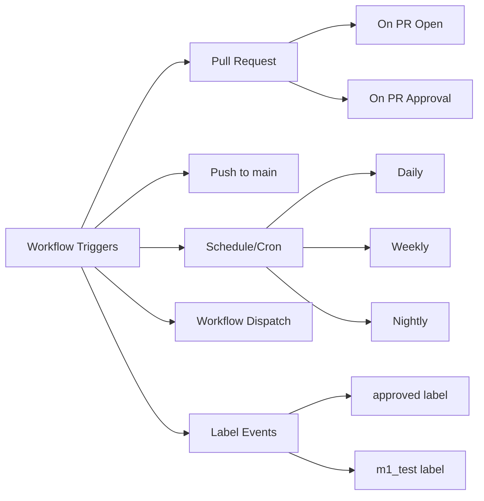

---

## 🧪 Testing & Validation Workflows

### CPU Testing Workflows

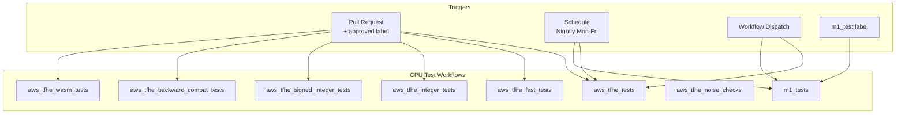

| Workflow | Trigger | Purpose | Runner |
|----------|---------|---------|--------|
| **aws_tfhe_tests** | PR (approved) / Nightly / Manual | Comprehensive CPU tests (csprng, zk-pok, core_crypto, boolean, shortint, strings, high-level API, C API, examples, apps) | AWS cpu-big |
| **aws_tfhe_fast_tests** | PR (approved) / Manual | Fast subset of tests for quick validation | AWS cpu-small |
| **aws_tfhe_integer_tests** | PR (approved) / Manual | Integer operations testing | AWS cpu-big |
| **aws_tfhe_signed_integer_tests** | PR (approved) / Manual | Signed integer operations testing | AWS cpu-big |
| **aws_tfhe_backward_compat_tests** | PR (approved) / Manual | Backward compatibility validation | AWS cpu-small |
| **aws_tfhe_wasm_tests** | PR (approved) / Manual | WebAssembly tests | AWS cpu-small |
| **aws_tfhe_noise_checks** | PR (approved) / Manual | Cryptographic noise validation | AWS cpu-small |
| **m1_tests** | Manual / Schedule (10pm daily) / m1_test label | Tests on Apple M1 architecture | Self-hosted M1 Mac |

---

### GPU Testing Workflows

```mermaid
flowchart TB
    subgraph "GPU Test Workflows"
        GFAST[gpu_fast_tests]
        G4090[gpu_4090_tests]
        GH100F[gpu_fast_h100_tests]
        GH100[gpu_full_h100_tests]
        GMULTI[gpu_full_multi_gpu_tests]
        GVAL[gpu_code_validation_tests]
        GMEM[gpu_memory_sanitizer]
        GMEMH[gpu_memory_sanitizer_h100]
        GUINT[gpu_unsigned_integer_tests]
        GSINT[gpu_signed_integer_tests]
        GUINTC[gpu_unsigned_integer_classic_tests]
        GSINTC[gpu_signed_integer_classic_tests]
        GUINTH[gpu_unsigned_integer_h100_tests]
        GSINTH[gpu_signed_integer_h100_tests]
        GLONG[gpu_integer_long_run_tests]
        GPCC[gpu_pcc]
    end
    
    subgraph "Triggers"
        PR[Pull Request]
        DISP[Workflow Dispatch]
        APPR[PR approved label]
    end
    
    PR --> GFAST
    DISP --> GFAST
    
    DISP --> G4090
    DISP --> GH100F
    DISP --> GH100
    DISP --> GMULTI
    DISP --> GVAL
    
    APPR --> GMEM
    APPR --> GMEMH
    APPR --> GUINT
    APPR --> GSINT
    APPR --> GPCC
```

| Workflow | Trigger | Purpose | GPU |
|----------|---------|---------|-----|
| **gpu_fast_tests** | PR / Manual | Quick GPU validation tests | Hyperstack GPU |
| **gpu_4090_tests** | Manual | Tests on RTX 4090 hardware | RTX 4090 |
| **gpu_fast_h100_tests** | Manual | Fast tests on H100 GPU | H100 |
| **gpu_full_h100_tests** | Manual | Comprehensive H100 tests | H100 |
| **gpu_full_multi_gpu_tests** | Manual | Multi-GPU testing | Multiple GPUs |
| **gpu_code_validation_tests** | Manual | GPU code validation | GPU |
| **gpu_memory_sanitizer** | PR (approved) / Manual | Memory leak detection | GPU |
| **gpu_memory_sanitizer_h100** | PR (approved) / Manual | Memory sanitizer on H100 | H100 |
| **gpu_unsigned_integer_tests** | PR (approved) / Manual | Unsigned integer GPU tests | GPU |
| **gpu_signed_integer_tests** | PR (approved) / Manual | Signed integer GPU tests | GPU |
| **gpu_unsigned_integer_classic_tests** | Manual | Classic unsigned integer tests | GPU |
| **gpu_signed_integer_classic_tests** | Manual | Classic signed integer tests | GPU |
| **gpu_unsigned_integer_h100_tests** | Manual | Unsigned integer tests on H100 | H100 |
| **gpu_signed_integer_h100_tests** | Manual | Signed integer tests on H100 | H100 |
| **gpu_integer_long_run_tests** | Manual | Long-running integer tests | GPU |
| **gpu_pcc** | PR (approved) / Manual | GPU PCC checks | GPU |

---

### HPU Testing Workflows

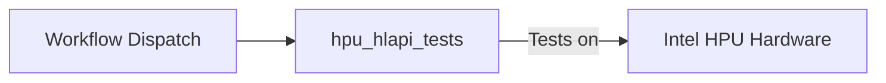

| Workflow | Trigger | Purpose | Hardware |
|----------|---------|---------|----------|
| **hpu_hlapi_tests** | Manual | High-level API tests on Intel HPU | Intel HPU |

---

### Special Testing Workflows

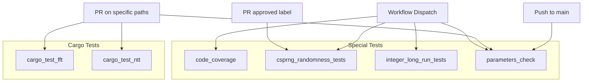

| Workflow | Trigger | Purpose |
|----------|---------|---------|
| **code_coverage** | Manual | Generate code coverage reports and upload to Codecov |
| **csprng_randomness_tests** | Manual / PR (approved) | Dieharder randomness test suite for CSPRNG |
| **integer_long_run_tests** | Manual | Extended integer testing |
| **parameters_check** | Push to main / PR (specific paths) / Manual | Security check on cryptographic parameters using lattice estimator |
| **cargo_test_fft** | PR | Run tfhe-fft tests |
| **cargo_test_ntt** | PR | Run tfhe-ntt tests |

---

## 🏗️ Building & Compilation Workflows (4 workflows)

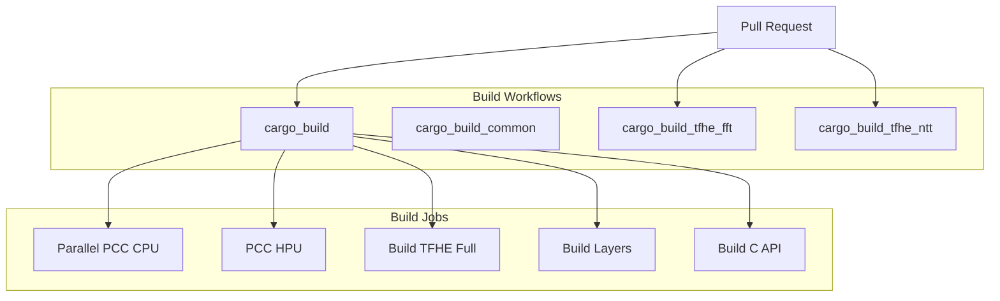

| Workflow | Trigger | Purpose |
|----------|---------|---------|
| **cargo_build** | PR | Main build workflow - coordinates all build jobs |
| **cargo_build_common** | Reusable | Shared build logic for different targets |
| **cargo_build_tfhe_fft** | PR | Build and validate tfhe-fft crate |
| **cargo_build_tfhe_ntt** | PR | Build and validate tfhe-ntt crate |

**Build Targets:**
- ✅ Parallel PCC (Program Counter Checks) for CPU
- ✅ PCC for HPU
- ✅ Full TFHE build (Linux, macOS M1, Windows)
- ✅ Layer-by-layer builds
- ✅ C API builds

---

## 📊 Benchmarking Workflows (17 workflows)

All benchmark workflows are **triggered manually** via workflow_dispatch.

```mermaid
flowchart TB
    subgraph "CPU Benchmarks - 3 workflows"
        BCPU[benchmark_cpu<br/>Main CPU benchmarks]
        BCPUW[benchmark_cpu_weekly<br/>Weekly CPU benchmarks]
        BCPUC[benchmark_cpu_common<br/>Reusable workflow]
    end
    
    subgraph "GPU Benchmarks - 5 workflows"
        BGPU[benchmark_gpu<br/>Main GPU benchmarks]
        BGPUW[benchmark_gpu_weekly<br/>Weekly GPU benchmarks]
        BGPUC[benchmark_gpu_common<br/>Reusable workflow]
        BGPU4090[benchmark_gpu_4090<br/>RTX 4090 specific]
        BGPUCOP[benchmark_gpu_coprocessor<br/>Coprocessor mode]
    end
    
    subgraph "HPU Benchmarks - 2 workflows"
        BHPU[benchmark_hpu<br/>Intel HPU benchmarks]
        BHPUC[benchmark_hpu_common<br/>Reusable workflow]
    end
    
    subgraph "Specialized Benchmarks - 7 workflows"
        BWASM[benchmark_wasm_client<br/>WebAssembly client]
        BCT[benchmark_ct_key_sizes<br/>Ciphertext & key sizes]
        BFFT[benchmark_tfhe_fft<br/>FFT performance]
        BNTT[benchmark_tfhe_ntt<br/>NTT performance]
        BWHITE[benchmark_whitepaper<br/>Whitepaper params]
        BREG[benchmark_perf_regression<br/>Regression detection]
        BDOC[benchmark_documentation<br/>Generate docs]
    end
    
    DISP[Workflow Dispatch<br/>Manual Trigger] --> BCPU
    DISP --> BCPUW
    DISP --> BGPU
    DISP --> BGPUW
    DISP --> BHPU
    DISP --> BWASM
    DISP --> BCT
    DISP --> BFFT
    DISP --> BNTT
    DISP --> BWHITE
    DISP --> BREG
    DISP --> BDOC
    DISP --> BGPU4090
    DISP --> BGPUCOP
```

### CPU Benchmarks (3 workflows)

| Workflow | Purpose | Operations Tested |
|----------|---------|-------------------|
| **benchmark_cpu** | Main CPU performance benchmarks | integer, signed_integer, integer_compression, integer_zk, shortint, shortint_oprf, hlapi, hlapi_erc20, hlapi_dex, hlapi_noise_squash, tfhe_zk_pok, boolean, pbs, pbs128, ks, ks_pbs |
| **benchmark_cpu_weekly** | Weekly scheduled CPU benchmarks | Similar to benchmark_cpu |
| **benchmark_cpu_common** | Reusable workflow for CPU benchmarks | Shared logic |

### GPU Benchmarks (5 workflows)

| Workflow | Purpose | Hardware |
|----------|---------|----------|
| **benchmark_gpu** | Main GPU performance benchmarks | Standard GPU |
| **benchmark_gpu_weekly** | Weekly scheduled GPU benchmarks | Standard GPU |
| **benchmark_gpu_4090** | Benchmarks on RTX 4090 | RTX 4090 |
| **benchmark_gpu_coprocessor** | GPU coprocessor mode benchmarks | GPU |
| **benchmark_gpu_common** | Reusable workflow for GPU benchmarks | Shared logic |

### HPU Benchmarks (2 workflows)

| Workflow | Purpose | Hardware |
|----------|---------|----------|
| **benchmark_hpu** | Intel HPU performance benchmarks | Intel HPU |
| **benchmark_hpu_common** | Reusable workflow for HPU benchmarks | Shared logic |

### Specialized Benchmarks (7 workflows)

| Workflow | Purpose | Focus |
|----------|---------|-------|
| **benchmark_wasm_client** | WebAssembly client performance | WASM execution |
| **benchmark_ct_key_sizes** | Measure ciphertext and key sizes | Memory footprint |
| **benchmark_tfhe_fft** | FFT library performance | tfhe-fft crate |
| **benchmark_tfhe_ntt** | NTT library performance | tfhe-ntt crate |
| **benchmark_whitepaper** | Whitepaper parameter validation | Research params |
| **benchmark_perf_regression** | Detect performance regressions | Regression testing |
| **benchmark_documentation** | Generate benchmark documentation | Documentation |

### Benchmark Configuration Options

**📏 Operation Flavors:**
- `default` - Standard operations
- `fast_default` - Fast variant operations
- `smart` - Smart operations (with automatic PBS)
- `unchecked` - Unchecked operations (no PBS)
- `misc` - Miscellaneous operations

**🎯 Precision Sets:**
- `fast` - Quick validation subset
- `all` - All supported bit precisions
- `documentation` - Precisions for documentation

**⏱️ Benchmark Types:**
- `latency` - Single operation timing
- `throughput` - Operations per second
- `both` - Both latency and throughput

**🔧 Parameter Types:**
- `classical` - Classical parameters
- `multi_bit` - Multi-bit parameters
- `classical + multi_bit` - Both parameter sets
- `classical_documentation` - Classical for docs
- `multi_bit_documentation` - Multi-bit for docs
- `classical_documentation + multi_bit_documentation` - Both for docs

---

## 📦 Release Management Workflows (9 workflows)

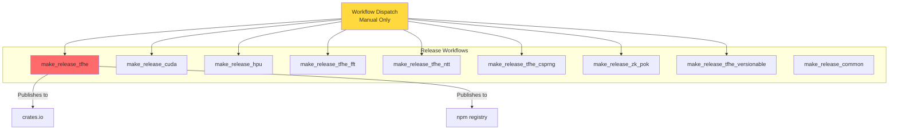

| Workflow | Purpose | Platforms |
|----------|---------|-----------|
| **make_release_tfhe** | Release main TFHE library | crates.io, npm (web & node packages) |
| **make_release_cuda** | Release CUDA backend | crates.io |
| **make_release_hpu** | Release HPU backend | crates.io |
| **make_release_tfhe_fft** | Release FFT library | crates.io |
| **make_release_tfhe_ntt** | Release NTT library | crates.io |
| **make_release_tfhe_csprng** | Release CSPRNG library | crates.io |
| **make_release_zk_pok** | Release Zero-Knowledge Proof of Knowledge library | crates.io |
| **make_release_tfhe_versionable** | Release versionable trait library | crates.io |
| **make_release_common** | Shared release logic | Reusable workflow |

**Release Options:**
- 🧪 Dry-run mode
- 📦 Push to crates.io
- 🌐 Push web JS package
- 📱 Push Node.js package
- 🏷️ Set NPM latest tag

---

## 🛠️ CI/CD & Maintenance Workflows (10 workflows)

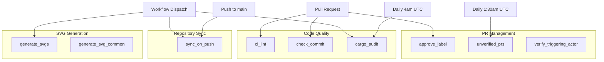

| Workflow | Trigger | Purpose |
|----------|---------|---------|
| **ci_lint** | PR | Lint workflows with actionlint & check security with zizmor |
| **check_commit** | PR | Validate commit message format, line length, and signatures |
| **approve_label** | PR / PR Review | Auto-manage "approved" label on PRs |
| **cargo_audit** | Daily 4am UTC / Manual | Check dependencies for security vulnerabilities |
| **unverified_prs** | Daily 1:30am UTC | Close PRs without CLA signature after 2 days |
| **verify_triggering_actor** | Various | Verify actor permissions for sensitive workflows |
| **sync_on_push** | Push to main / Manual | Sync repository to internal mirror |
| **generate_svgs** | Manual | Generate parameter curve SVG visualizations |
| **generate_svg_common** | Reusable | Common SVG generation logic |
| **placeholder_workflow** | N/A | Template workflow |

---

## 🔐 Security & Quality Workflows

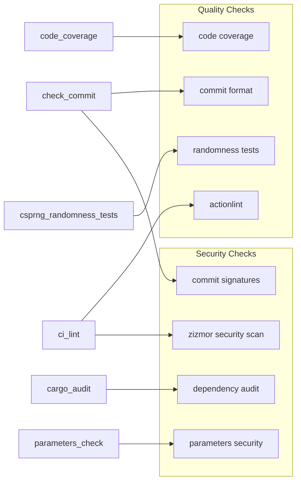

---

## 📈 Workflow Statistics

### By Trigger Type

| Trigger | Count | Examples |
|---------|-------|----------|
| **Workflow Dispatch** (Manual) | 65 | All benchmarks, releases, most tests |
| **Pull Request** | 18 | Build, lint, fast tests, GPU tests |
| **Pull Request (approved label)** | 12 | AWS tests, GPU memory tests |
| **Schedule/Cron** | 5 | Nightly tests, audit, unverified PRs |
| **Push to main** | 2 | Sync, parameters check |
| **Label Events** | 3 | M1 tests, approve workflow |

### By Runner Type

| Runner | Count | Purpose |
|--------|-------|---------|
| **AWS CPU** | 15 | Main testing infrastructure |
| **Hyperstack GPU** | 13 | GPU testing and benchmarks |
| **Self-hosted M1 Mac** | 1 | Apple Silicon testing |
| **Intel HPU** | 2 | HPU testing and benchmarks |
| **Ubuntu Latest** | 25 | CI/CD, builds, coordination |
| **Windows** | 1 | Windows builds |

---

## 🎯 Key Workflow Patterns

### 1. Instance Management Pattern

Many workflows follow this pattern for cost optimization:

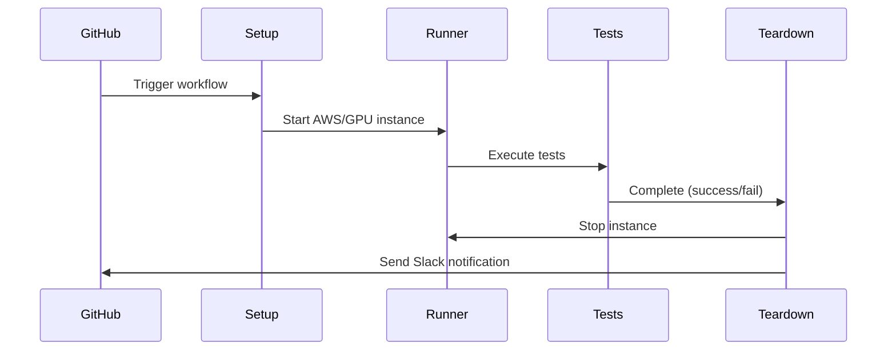

**Workflows using this pattern:**
- All `aws_tfhe_*` workflows
- All `gpu_*` workflows  
- `hpu_hlapi_tests`
- `code_coverage`
- `parameters_check`
- `csprng_randomness_tests`

### 2. Branch Protection Rules (BPR)

Workflows marked with `(bpr)` are required for PRs to be merged:

- ✅ `cargo_build/cargo-builds (bpr)`
- ✅ `ci_lint/lint-check (bpr)`
- ✅ `check_commit/check-commit-pr (bpr)`

### 3. File Change Detection

Many workflows use `tj-actions/changed-files` to conditionally run tests based on changed files, optimizing CI time and resources.

---

## 🔄 Workflow Dependencies

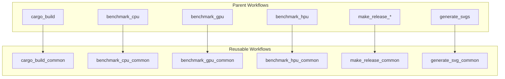

---

## 📝 Workflow Naming Convention

```
<category>_<component>_<type>
```

Examples:
- `aws_tfhe_tests` - AWS infrastructure, TFHE component, tests type
- `gpu_fast_tests` - GPU infrastructure, fast variant, tests type
- `benchmark_cpu_weekly` - Benchmark category, CPU target, weekly schedule
- `make_release_tfhe` - Make/release action, TFHE component

---

## 🚀 Quick Reference

### Running Tests on PR

1. **Quick validation**: Automatic on PR creation
   - `cargo_build` - Build checks
   - `ci_lint` - Linting
   - `check_commit` - Commit format
   - `gpu_fast_tests` - Basic GPU tests

2. **Full test suite**: After PR approval (add "approved" label)
   - `aws_tfhe_tests` - Comprehensive CPU tests
   - `gpu_memory_sanitizer` - Memory checks
   - GPU integer tests

3. **Special hardware**: Manual label addition
   - Add `m1_test` label for M1 Mac tests

### Running Benchmarks

All benchmarks are **manual only** via workflow dispatch. Choose:
- Target: CPU, GPU, HPU, or WASM
- Operation flavor: default, smart, unchecked
- Precision set: fast, all, documentation
- Benchmark type: latency, throughput, both

### Creating a Release

1. Run appropriate `make_release_*` workflow
2. Configure options (dry-run, push to crates, npm packages)
3. Workflow handles versioning, building, and publishing
4. Includes provenance and SLSA attestation

---

## 🔔 Notification System

All critical workflows send Slack notifications on:
- ❌ Failure
- 🚫 Cancellation (non-PR events)
- ⚠️ Instance teardown failures

Notifications include:
- Job status
- Pull request link (if applicable)
- Action run URL

---

## 📚 Additional Resources

- **Workflow Files**: `.github/workflows/`
- **Reusable Actions**: `.github/actions/`
- **Configuration**: `ci/slab.toml`
- **Scripts**: `scripts/` directory

---

## ✅ Verification Summary

**Total Workflows: 71**

Count by category:
- Testing & Validation: **31 workflows** (7 AWS CPU + 16 GPU + 1 HPU + 1 M1 + 4 special + 2 cargo tests)
- Benchmarking: **17 workflows** (3 CPU + 5 GPU + 2 HPU + 7 specialized)
- Building & Compilation: **4 workflows**
- Release Management: **9 workflows**
- CI/CD & Maintenance: **10 workflows**

**Verification:** 31 + 17 + 4 + 9 + 10 = **71** ✅

*Last Updated: 2026-01-08*