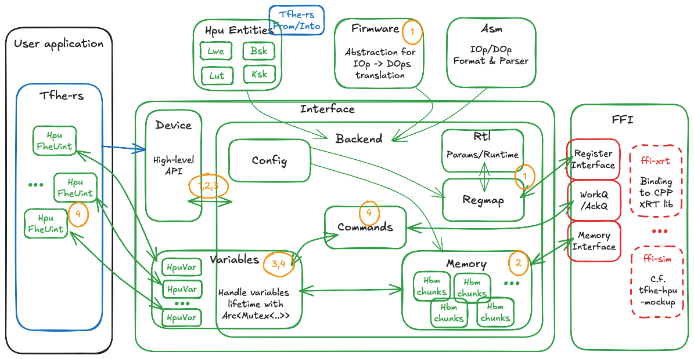

# TFHE-hpu-backend

## Brief
The `tfhe-hpu-backend` holds the code to interface with the HPU accelerator of TFHE.
It contains a `HpuDevice` abstraction that enables easy configuration and dispatching of TFHE operations on the HPU accelerator.

The user API exposes the following functions for hardware setup:
- `HpuDevice::new`, `HpuDevice::from_config`: Instantiates abstraction device from configuration file.
- `HpuDevice::init`: Configures and uploads the required public material.
- `new_var_from`: Creates a HPU ciphertext from `tfhe-rs` ciphertext.

HPU device could also be used from `integer` with the help of the following function:
- `tfhe::integer::hpu::init_device`: Init given HPU device with server key.
- `tfhe::integer::hpu::ciphertext::HpuRadixCiphertext::from_radix_ciphertext`: Convert a CpuRadixCiphertext in it's HPU counterpart.
 
HPU device could also be used seamlessly from `hl-api` by setting up a thread-local HPU server key:
- `tfhe::Config::from_hpu_device`: Extract hl-api configuration from HpuDevice.
- `tfhe::set_server_key`: Register the Hpu server key in the current thread.

HPU variables could also be created from a `high-level-api` object, with the help of the `hw-xfer` feature.
This implements a trait that enables `clone_on`, `mv_on` `FheUint` object on the HPU accelerator, and cast back `from` them.

These objects implement the `std::ops` trait and could be used to dispatch operations on HPU hardware.

### Backend structure
`tfhe-hpu-backend` is split in various modules:
- `entities`: Defines structure handled by HPU accelerator. Conversion traits from/into those objects are implemented in `tfhe-rs`.
- `asm`: Describes assembly-like language for the HPU. It enables abstract HPU behavior and easily updates it through micro-code.
- `fw`: Abstraction to help the micro-code designer. Uses a simple rust program for describing new HPU operations. Helps with register/heap management.
- `interface`:
  + `device`: High-level structure that exposes the User API.
  + `backend`: Inner private structure that contains HPU modules
  + `variable`: Wraps HPU ciphertexts. It enables to hook an hardware object lifetime within the `rust` borrow-checker.
  + `memory`: Handles on-board memory allocation and synchronization
  + `config`: Helps to configure HPU accelerator through a TOML configuration file
  + `cmd`: Translates operation over `variable` in concrete HPU commands
  + `regmap`: Communicates with the HPU internal register with ease.
  + `rtl`: Defines concrete `rust` structure populated from HPU's status/configuration registers


Below is an overview of the internal structure of the Backend.


This picture depicts the internal modules of `tfhe-hpu-backend`, Device is the main entry point for the user. Its lifecycle is as follows:

1. Create HpuDevice, open link with the associated FPGA. Configure associated drivers and upload the bitstream. Read FPGA registers to extract supported configuration and features. Build Firmware conversion table (IOp -> DOps stream).

2. Allocate required memory chunks in the on-board memory. Upload public material required by TFHE computation.

3. Create HPU variables that handle TFHE Ciphertexts. It wraps TFHE Ciphertext with required internal resources and enforces the correct lifetime management. This abstraction enforces that during the variable lifecycle all required resources are valid.

4. Users could trigger HPU operation from the HPU variable.
  Variable abstraction enforces that required objects are correctly synced on the hardware and converts each operation in a concrete HPU command.
  When HPU operation is acknowledged by the hardware, the internal state of the associated variable is updated.
  This mechanism enables asynchronous operation and minimal amount of Host to/from HW memory transfer.
  This mechanism also enables offloading a computation graph to the HPU and requires a synchronization only on the final results.

## Example
### Configuration file
HPU configuration knobs are gathered in a TOML configuration file. This file describes the targeted FPGA with its associated configuration:
```toml
[fpga] # FPGA target
  # Register layout in the FPGA
  regmap=["${HPU_BACKEND_DIR}/config_store/${HPU_CONFIG}/hpu_regif_core_cfg_1in3.toml",
          "${HPU_BACKEND_DIR}/config_store/${HPU_CONFIG}/hpu_regif_core_cfg_3in3.toml",
          "${HPU_BACKEND_DIR}/config_store/${HPU_CONFIG}/hpu_regif_core_prc_1in3.toml",
          "${HPU_BACKEND_DIR}/config_store/${HPU_CONFIG}/hpu_regif_core_prc_3in3.toml"]
  polling_us=1
  node_id=[0,1,2,3] # example for a 4 HPU cluster
[fpga.ffi.V80] # Hardware properties
  hpu_path="${HPU_BACKEND_DIR}/config_store/v80_archives/psi64.hpu"
  ami_path="${AMI_PATH}/ami.ko"

[rtl] # RTL option
  bpip_used = true # BPIP/IPIP mode
  bpip_use_opportunism = false # Use strict flush paradigm
  bpip_timeout = 100_000 # BPIP timeout in clock `cycles`

[board] # Board configuration
  ct_pc = [ # Memory used for ciphertext
    {Hbm= {pc=32}},
    {Hbm= {pc=33}},
  ]
  user_size = 12288 # Number of slots reserved for host ciphertexts
  b2b_size = 4096   # Number of slots reserved for ciphertexts exchanged between HPUs
  heap_size = 16384 # Number of slots reserved for heap

  lut_mem = 256 # Number of allocated LUT table
  lut_pc = {Hbm={pc=34}} # Memory used for LUT

  fw_size= 16777216 # Size in byte of the Firmware translation table
  fw_pc = {Ddr= {offset= 0x3900_0000}} # Memory used for firmware translation table

  bsk_pc = [ # Memory used for Bootstrapping key
    {Hbm={pc=8}},
    {Hbm={pc=10}},
    {Hbm={pc=12}},
    {Hbm={pc=14}},
    {Hbm={pc=24}},
    {Hbm={pc=26}},
    {Hbm={pc=28}},
    {Hbm={pc=30}},
    {Hbm={pc=40}},
    {Hbm={pc=42}},
    {Hbm={pc=44}},
    {Hbm={pc=46}},
    {Hbm={pc=56}},
    {Hbm={pc=58}},
    {Hbm={pc=60}},
    {Hbm={pc=62}}
  ]

  ksk_pc = [ # Memory used for Keyswitching key
    {Hbm={pc=0}},
    {Hbm={pc=1}},
    {Hbm={pc=2}},
    {Hbm={pc=3}},
    {Hbm={pc=4}},
    {Hbm={pc=5}},
    {Hbm={pc=6}},
    {Hbm={pc=7}},
    {Hbm={pc=16}},
    {Hbm={pc=17}},
    {Hbm={pc=18}},
    {Hbm={pc=19}},
    {Hbm={pc=20}},
    {Hbm={pc=21}},
    {Hbm={pc=22}},
    {Hbm={pc=23}}
  ]

  trace_pc = {Hbm={pc=35}} # Memory used for trace log
  trace_depth = 32 # Size of Memory in MiB allocated for trace log

[firmware] # Firmware properties
  implementation = "Llt" # Firmware flavor to use
  integer_w=[2,4,8,16,32,64,128] # List of supported IOp width
  min_batch_size = 12 # Minimum batch size for maximum throughput
  kogge_cfg            = "${HPU_BACKEND_DIR}/config_store/${HPU_CONFIG}/kogge_cfg.toml"

[firmware.custom_iop.integer_w_2]
  'IOP[16]' = "${HPU_BACKEND_DIR}/config_store/custom_iop/integer_w_2/cust_16"

[firmware.custom_iop.integer_w_4]
  'IOP[18]' = "${HPU_BACKEND_DIR}/config_store/custom_iop/integer_w_4/cust_18"

[firmware.custom_iop.integer_w_6]
  'IOP[8]'  = "${HPU_BACKEND_DIR}/config_store/custom_iop/integer_w_6/cust_8"

[firmware.custom_iop.integer_w_8]
  'IOP[0]'  = "${HPU_BACKEND_DIR}/config_store/custom_iop/integer_w_8/cust_0"
...
  'IOP[37]' = "${HPU_BACKEND_DIR}/config_store/custom_iop/integer_w_8/cust_37"

[firmware.custom_iop.integer_w_16]
  'IOP[21]' = "${HPU_BACKEND_DIR}/config_store/custom_iop/integer_w_16/cust_21"
  'IOP[33]' = "${HPU_BACKEND_DIR}/config_store/custom_iop/integer_w_16/cust_33"

[firmware.custom_iop.integer_w_32]
  'IOP[33]'  = "${HPU_BACKEND_DIR}/config_store/custom_iop/integer_w_32/cust_33"
  'IOP[40]'  = "${HPU_BACKEND_DIR}/config_store/custom_iop/integer_w_32/cust_40"

[firmware.custom_iop.integer_w_64]
  'IOP[4]'  = "${HPU_BACKEND_DIR}/config_store/custom_iop/integer_w_64/cust_4"
  'IOP[33]'  = "${HPU_BACKEND_DIR}/config_store/custom_iop/integer_w_64/cust_33"
  'IOP[40]'  = "${HPU_BACKEND_DIR}/config_store/custom_iop/integer_w_64/cust_40"

[firmware.custom_iop.integer_w_128]
  'IOP[5]'  = "${HPU_BACKEND_DIR}/config_store/custom_iop/integer_w_128/cust_5"
  'IOP[6]'  = "${HPU_BACKEND_DIR}/config_store/custom_iop/integer_w_128/cust_6"
  'IOP[7]'  = "${HPU_BACKEND_DIR}/config_store/custom_iop/integer_w_128/cust_7"
  'IOP[15]'  = "${HPU_BACKEND_DIR}/config_store/custom_iop/integer_w_128/cust_15"

# Default firmware configuration. Could be edited on per-IOp basis
[firmware.op_cfg.default]
  fill_batch_fifo = true
  min_batch_size = false
  use_tiers = false
  flush_behaviour = "Patient"
  flush = true
  ```

### Device setup
Following code snippet shows how to instantiate and configure a `HpuDevice`:
```rust
    // Following code snippets used the HighLevelApi abstraction
    // Instantiate HpuDevice --------------------------------------------------
    let hpu_device = HpuDevice::from_config(&config_path.expand(), false)
        .expect("Hpu device init failed");

    // Generate keys ----------------------------------------------------------
    let config = Config::from_hpu_device(&hpu_device);

    let cks = ClientKey::generate(config);
    let csks = CompressedServerKey::new(&cks);

    // Register HpuDevice and key as thread-local engine
    set_server_key((hpu_device, csks));
```

### Clone CPU ciphertext on HPU
Following code snippet shows how to convert CPU ciphertext in HPU one:
``` rust
    // Draw random value as input
    let a = rand::thread_rng().gen_range(0..u8::MAX);

    // Encrypt them on Cpu side
    let a_fhe = FheUint8::encrypt(a, &cks);

    // Clone a ciphertext and move them in HpuWorld
    // NB: Data doesn't move over Pcie at this stage
    //     Data are only arranged in Hpu ordered an copy in the host internal buffer
    let a_hpu = a_fhe.clone_on(&hpu_device);
```

### Dispatch operation on HPU
Once registered as thread-local engine, HighLevel FheUint are converted in Hpu format.
Following code snippets show how to start operation on HPU:

``` rust
  // Sum -------------------------------------------------------------
  // Generate random inputs value and compute expected result
  let in_a = rng.gen_range(0..u64::max_value());
  let in_b = rng.gen_range(0..u64::max_value());
  let clear_sum_ab = in_a.wrapping_add(in_b);

  // Encrypt input value
  let fhe_a = FheUint64::encrypt(in_a, cks);
  let fhe_b = FheUint64::encrypt(in_b, cks);

  // Triggered operation on HPU through hl_api
  let fhe_sum_ab = fhe_a+fhe_b;

  // Decrypt values
  let dec_sum_ab: u64 = fhe_sum_ab.decrypt(cks);
```

## HPU cluster setup
HPU can now be part of a cluster of 2 to 8 FPGA. Each of these HPU needs to be connected via 25Gb Ethernet link on lane 0 of QSFP module 3 (port 4)
to all the other HPU of the cluster (usually via a switch).

Before doing any run on hardware using HPU backend, you need to setup the local environment:
```  bash
# create a "hw" group for driver & PCIe devices access & add current user to this group
$ sudo groupadd hw
$ sudo usermod -aG hw username

# update sudo rules (verify that /etc/sudoers.d directory is included correctly in /etc/sudoers)
$ sudo cp <path>/tfhe-rs/backends/tfhe-hpu-backend/scripts/v80_sudo_rules /etc/sudoers.d/

# compile AMI driver (at this point we use revision bd569ee)
$ git clone git@github.com:zama-ai/AVED.git zama_aved
$ cd zama_aved/sw/AMI/driver
$ make
$ sudo mkdir -p /opt/v80/ami/bd569ee/
$ sudo chown -R root:hw /opt/v80
$ sudo chmod -R 775 /opt/v80
$ cp ami.ko /opt/v80/ami/bd569ee/
$ cd ..
$ make -C api all
$ make -C app all

# if your V80 boards are loaded with correct bitstream you can try
$ sudo insmod /opt/v80/ami/bd569ee/ami.ko

# setup cluster description profile: collect serial numbers &
# MAC addresses
# list V80 devices
$ lspci -d 10ee:50b4
01:00.0 Processing accelerators: Xilinx Corporation Device 50b4
24:00.0 Processing accelerators: Xilinx Corporation Device 50b4
81:00.0 Processing accelerators: Xilinx Corporation Device 50b4
a1:00.0 Processing accelerators: Xilinx Corporation Device 50b4
# if AMI driver can be loaded use its information to fill
# the file <path>/backends/tfhe-hpu-backend/scripts/v80_pcie_dev.sh
$ cat /sys/module/ami/drivers/pci\:ami/0000\:01\:00.0/board_serial
XFL1C0UK15KC
$ cat /sys/module/ami/drivers/pci\:ami/0000\:01\:00.0/mac_addr
00:0a:35:25:43:C0
# in v80_pcie_dev.sh only the MAC 3 LSB are set (here 0x2543C0)
...
# if AMI driver cannot be loaded you can get the serial numbers using xsdb
# but it is not easy to match serial numbers with PCIe devices
# you can keep default MAC addresses for now and update later when AMI can be loaded
$ xsdb -eval "connect;puts [lsort -unique [regex -all -inline {( XFL[A-Z0-9]*)} [targets -target-properties]]]"
****** Xilinx hw_server v2024.2
  **** Build date : Oct 29 2024 at 10:16:47
    ** Copyright 1986-2022 Xilinx, Inc. All Rights Reserved.
    ** Copyright 2022-2024 Advanced Micro Devices, Inc. All Rights Reserved.

INFO: hw_server application started
INFO: Use Ctrl-C to exit hw_server application

INFO: To connect to this hw_server instance use url: TCP:127.0.0.1:3121

{ XFL1C0UK15KCA} { XFL1TYZ3GUIXA} { XFL1ORE0X5YBA} { XFL1OGGL9CT4A}
...
# you need to remove the 'A' at the end of these serial numbers
# and then copy this file in /etc/profile.d/
$ cp <path>/backends/tfhe-hpu-backend/scripts/v80_pcie_dev.sh /etc/profile.d/
$ . /etc/profile.d/v80_pcie_dev.sh
# you should be able to display cluster description:
$ display_v80_board_map 
@0: pcie_id:01, serial_number:XFL1C0UK15KC, mac_address:0x2543C0
@1: pcie_id:24, serial_number:XFL1TYZ3GUIX, mac_address:0x25AB50
@2: pcie_id:81, serial_number:XFL1ORE0X5YB, mac_address:0x2468F0
@3: pcie_id:A1, serial_number:XFL1OGGL9CT4, mac_address:0x249080
```
At this point, you should also update the file `<path>/tfhe-rs/backends/tfhe-hpu-backend/config_store/v80/hpu_config.toml` to reflect how many HPU are available or which one you want to use. For example, if you have x8 V80 available you should modify `node_id=[0,1,2,3]` to `node_id=[0,1,2,3,4,5,6,7]` to let HPU backend know that you want to use all x8 HPU.

## Pre-made Examples
There are some example applications already available in `tfhe/examples/hpu`:
 * hpu_hlapi: Depict the used of HPU device through HighLevelApi.
 * hpu_bench: Depict the used of HPU device through Integer abstraction level.

In order to run those applications on hardware, user must build from the project root (i.e `tfhe-rs`) with `hpu-v80` features:

> NB: Running examples required to have correctly pulled the `.hpu` files. Those files, due to their size, are backed by git-lfs and disabled by default.
> In order to retrieve them, run the following command from **TFHE-rs** root folder:
> ```bash
> make pull_hpu_files
> ```

``` bash
$ cargo build --release --features="hpu-v80" --example hpu_hlapi --example hpu_bench
# Correctly setup environment with setup_hpu.sh script
$ source setup_hpu.sh --config v80
$ ./target/release/examples/hpu_bench --integer-w 64 --integer-w 32 --iop MUL --iter 10
$ ./target/release/examples/hpu_hlapi
```

> NB: Error that occurred when ".hpu" files weren't correctly fetch could be a bit enigmatic: `memory allocation of ... bytes failed`
> If you encountered this issue, you should run the following command:
> ```bash
> make pull_hpu_files
> ```

> NB: By default setup_hpu.sh will set AMI_PATH to something like /opt/v80/ami/bd569ee where bd569ee is the git revision of AMI driver.
> To run properly, You need to either place a compiled ami.ko from this revision in this directory or set AMI_PATH to your AVED extraction:
> ```bash
> export AMI_PATH=/home/user/AVED/sw/AMI/driver/
> ```

## Test framework
There is also a set of tests backed in tfhe-rs. Tests are gather in testbundle over various integer width.
Those tests have 5 sub-kind:
* `alu`: Run and check all ct x ct IOp
* `alus`: Run and check all ct x scalar IOp
* `bitwise`: Run and check all bitwise IOp
* `cmp`: Run and check all comparison IOp
* `ternary`: Run and check ternary operation
* `algo`: Run and check IOp dedicated to offload small algorithms


Snippets below give some example of command that could be used for testing:
``` bash
# Correctly setup environment with setup_hpu.sh script
source setup_hpu.sh --config v80

# Run all sub-kind for 64b integer width
cargo test --release --features="hpu-v80" --test hpu -- u64

# Run only `bitwise` sub-kind for all integer width IOp
cargo test --release --features="hpu-v80" --test hpu -- bitwise
```

## Benches framework
HPU is completely integrated in tfhe benchmark system. Performances results could be extracted from HighLevelApi or Integer Api.
Three benchmarks could be started, through the following Makefile target for simplicity:
``` bash
# Do not forget to correctly set environment before hand
source setup_hpu.sh --config v80

# Run hlapi benches
make test_high_level_api_hpu

# Run hlapi erc7984 benches
make bench_hlapi_erc7984_hpu 

# Run integer level benches
make bench_integer_hpu
```

## Eager to start without real Hardware ?
You are still waiting your FPGA board and are frustrated by lead time ?
Don't worry, you have backed-up. A dedicated simulation infrastructure with accurate performance estimation is available in tfhe-rs.
You can use it on any linux/MacOs to test HPU integration within tfhe-rs and optimized your application for HPU target.
Simply through an eye to [HpuSim](https://github.com/zama-ai/hpu_sim), and follow the instruction.
