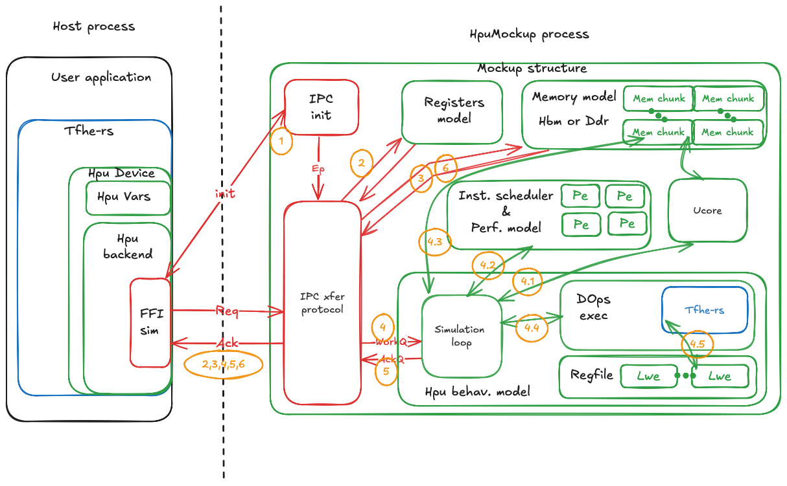

# TFHE-hpu-mockup

## Brief 
Simulation _drop-in-replacement_ implementation of HPU Hardware.
This mockup implementation could be paired seamlessly with `tfhe-hpu-backend` compiled without any hardware support (i.e. `hpu-v80` or `hpu-xrt`).
Indeed, without hardware support, `tfhe-hpu-backend` calls to low-level FFI are replaced by IPC calls and could be intercepted by this mockup implementation.

Objectives of this mockup are as follows:
* Transparent integration with User application:
> User must have nothing to change to his application code.
> Generated trace must match with the one obtained on the real hardware (except timestamp)

* Stimulus generation
> Obtained results must be bit-accurate in order to generate golden stimuli for RTL simulation
> RTL parameters must be fully configurable at runtime to easily generate stimuli for any configuration

* Firmware development
> Generate accurate performance estimation and tracing capabilities to help the development/optimization of HPU firmware

### Mockup structure
Without hardware support `tfhe-hpu-backend` falls back to a simulation FFI interface (i.e. `ffi-sim`). This interface binds to an IPC channel and forwards the FFI call over IPC with a simple Cmd/Payload message and Request/Ack protocol. The Mockup binds to those IPC and answer is to request like the real hardware.

On its side, the mockup answers to backend IPC requests and simulates the hardware behavior.
The internal structure of the mockup is organized around modules to emulate the hardware behavior. It contains the following modules:
* `memory`: Emulates memory such as Ddr and Hbm (only from a behavioral point of view). It enables to allocate/release chunk of memory. Those chunks could be read/write through the IPC with the same Sync mechanisms as the real hardware.
* `regmap`: Emulates the RTL register map. It converts concrete TFHE/RTL parameters into register value.
* `ucore`: Emulates the ucore behavior. It is in charge of reading the DOp stream from the HBM and patching the template operations in a same manner as it is done in the real hardware, to get the same patched DOp ucode.

> NB: Modeling of the `instruction_scheduler` is required for efficient firmware generation and thus directly done inside `tfhe-hpu-backend` crate in `isc_sim` modules. The mockup reuse this implementation directly.

The Mockup is a standalone binary that must be run before the User application code.
The use of two binaries enables to:
* Expose a wide range of mockup configuration without impacting the User application
* Have distinct streams of log: One for the mockup and one for the User application. Thus the trace log of the User application is unchanged compared to the real Hardware.

Below an overview of the internal structure of the Mockup.


After the Mockup starts, it registers an IPC configuration channel in a file that could be read by the `ffi-sim` to establish a connection.
Once done, the following steps occur:

> NB: Used filename is set in the TOML configuration file in FFI section. Environment variables could be used in the filename.
> ```toml
> [fpga.ffi.Sim]
> ipc_name="/tmp/${USER}/hpu_mockup_ipc"
> ```

1. Use configuration channel to exchange a set of IPC endpoints: one for registers access and one for memory management. Those channels implement a simple Cmd/Payload message and Request/Ack protocol.
2. `tfhe-hpu-backend` reads registers through the associated IPC channel and retrieves the associated mockup parameters.
3. `tfhe-hpu-backend` allocates required on-board memory. It then uploads the firmware translation table (Use to expand IOp in a stream of DOps), and the set of TFHE server keys. Then, it uploads the input ciphertext.
4. Once all input data is synced on the mockup, `tfhe-hpu-backend` triggered IOp execution by pushing operation in the `WorkQ`.
 4.1 HPU behavioral model retrieves the associated DOps stream from the HBM memory. For this purpose it uses the `ucore` module. This module reads the memory and patches the obtained stream to have concrete DOp to execute (The firmware translation table has some templated DOp that must be translated into concrete one before execution)
 4.2 DOp stream is then injected in the `instruction scheduler` to obtain the real execution order and the performance estimation.
 4.3 HPU behavioral model retrieves key material from the memory (i.e. in HPU format) and converts them back in Cpu format.
 4.4 HPU behavioral model executes the DOp with the help of `tfhe-rs` operation. 
 4.5 When needed, execution model reads the ciphertext from the `regfile`. 
 > NB: Ciphertexts are stored in the `regfile` in HPU format and translated back to CPU format before execution.
5. When IOp execution is finished the Mockup notifies the `tfhe-hpu-backend` through the `AckQ`.
6. `tfhe-hpu-backend` retrieves the results from the HBM with the help of IPC channels.


### Mockup CLI and configuration
The mockup application is configured by two files:
1. Configuration (i.e. `--config` CLI knob)
It's the same as the one used by the `tfhe-hpu-backend`. It's used by the mockup application to retrieve the `ffi-sim` configuration, the register map, as well as the expected memory layout of the on-board memory.

2. Parameters (i.e. `--params` CLI knob)
This file is used to retrieve the inner RTL parameters such as:
* TFHE parameter set
* NTT internal structure
* Instruction scheduler properties
* PC configuration for each HBM connection

Other optional configuration knobs are available:
* `--freq-hz`, `--register`, `isc-depth`: These knobs are used to override some parameters on the flight. They are useful for quick exploration.
* `--dump-out`, `--dump-reg`: Use for RTL stimuli generation and debug
* `--report-out`, `report-trace`: Use for detailed analysis of the performances report
* `--nops`: Disable tfhe-rs computation. Obsviously led to incorrect behavior but accurate performance estimation.
* `--log-out`: Write trace message in the given file instead of stdio.

On top of that `tfhe-hpu-mockup` could generate a detailed set of trace points at runtime to help during the debug/exploration phase (e.g. When writing new Hpu firmware).
Those trace points rely on `tokio-tracing` and could be activated on a path::verbosity based through the `RUST_LOG` environment variable.
For example the following value will enable the info trace for all the design and the debug one for the ucore submodule:
`RUST_LOG=info,tfhe_hpu_mockup::modules::ucore=debug`.

> NB: With the mockup estimated IOp performances must be read from the mockup log, not from the user application report.
> Indeed, the user application reports the execution time of the mockup binary not the expected performance on real Hpu hardware.


## Example
The following section explains how to run the user application examples on the mockup backend.
> NB: The use of the mockup instead of the real hardware is transparent for the user application.
> Only changes in the configuration file are required, and no hardware support should be activated during compilation (i.e. features like `hpu-v80` or `hpu-xrt`).


### HPU configuration selection
For convenience a simulation configuration is available in `backends/tfhe-hpu-backend/config_store/sim`.
Select the desired configuration with help of `setup_hpu.sh`:

```bash
source setup_hpu.sh --config sim
```

> NB: For convenience, a Justfile is provided with different targets to build and start User/Mockup applications.
> Open two terminals and, for example
> Start `just mockup` in the first one and start `just hpu_bench` in the second one.
> For list of available target use `just`

### Start mockup application
Two parameter kinds are provided for convenience:
* `mockups/tfhe-hpu-mockup/params/tfhers_*_fast.ron`:
 > Use a fake parameters set with small lwe_n. Simulation is fast. Useful for debug and test

* `mockups/tfhe-hpu-mockup/params/tfhers_*.ron`:
> Use real Hardware parameter set. Simulation is slow, but it enables to generate bit-accurate results and accurate performances estimation. Useful for RTL stimulus generation and FW exploration.

```bash
# Example of CLI for building/running mockup application
# For convenience, `just mockup` could be also used
cargo build --release --bin hpu_mockup
./target/release/hpu_mockup \
  --params mockups/tfhe-hpu-mockup/params/gaussian_64b_fast.ron \
  [--freq-hz --register --isc-depth]
  [--dump-out mockup_out/ --dump-reg]\
  [--report-out mockup_rpt/ --report-trace]
```

### Start user application
In the snippets below, `hpu_bench` is selected but any application using HPU hardware could be used.

```bash
# Example of CLI for building/running hpu_bench application
# For convenienc, `just hpu_bench` could be also used
cargo build --release --features="hpu" --example hpu_bench
# Start MUL and ADD IOp on 64b integer
./target/release/examples/hpu_bench --integer-w 64 --iop MUL --iop ADD
```


## Test
Hpu test framework could also be started with the mockup. It relies on the same configuration mechanism (c.f. [setup_hpu.sh](#HPU-configuration-selection)). 

> In same fashion as example a dedicated Justfile entry is available for the test
> Open two terminals and run the following
> Start `just mockup` in the first one and start `just hpu_test` in the second one.


### Start mockup application
Mockup starting process is the same as for examples (c.f. [Start Mockup](#Start-mockup-application)).

### Start test framework
In the snippets below, hpu test framework is started on 8b integer.

```bash
# Example of CLI for running hpu test framework
# For convenience, `just hpu_test` could be also used
# Test is defined for 8/16/32/64 and 128 bits integer, without specification all integer width are started
cargo run --release --features="hpu" --test hpu -- u8

# Filtering could also be used to sub-categories
# Available sub-categories are:
# * alus: for ct x scalar arithmetic IOps
# * alu: for ct x ct arithmetic IOps
# * bitwise: for ct x ct bitwise IOps
# * cmp: for comparison IOps
# * ternary: for if-then-else and like IOps
# * algo: for IOps dedicated to offload sub-algorithm like ERC_20
# Command below only run comparison IOps, for convenience, `just hpu_test "cmp"` could be also used
cargo run --release --features="hpu" --test hpu -- cmp
```
