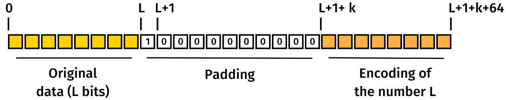

# Tutorial

## Intro

In this tutorial we will go through the steps to turn a regular sha256 implementation into its homomorphic version. We explain the basics of the sha256 function first, and then how to implement it homomorphically with performance considerations.

## Sha256

The first step in this experiment is actually implementing the sha256 function. We can find the specification [here](https://nvlpubs.nist.gov/nistpubs/FIPS/NIST.FIPS.180-4.pdf), but let's summarize the three main sections of the document.

#### Padding

The sha256 function processes the input data in blocks or chunks of 512 bits. Before actually performing the hash computations we have to pad the input in the following way:
* Append a single "1" bit
* Append a number of "0" bits such that exactly 64 bits are left to make the message length a multiple of 512
* Append the last 64 bits as a binary encoding of the original input length

Or visually:



Where the numbers on the top represent the length of the padded input at each position, and L+1+k+64 is a multiple of 512 (the length of the padded input).

#### Operations and functions

Let's take a look at the operations that we will use as building blocks for functions inside the sha256 computation. These are bitwise AND, XOR, NOT, addition modulo 2^32 and the Rotate Right (ROTR) and Shift Right (SHR) operations, all working with 32-bit words and producing a new word.

We combine these operations inside the sigma (with 4 variations), Ch and Maj functions. At the end of the day, when we change the sha256 to be computed homomorphically, we will mainly change the isolated code of each operation.

Here is the definition of each function:
```
Ch(x, y, z) = (x AND y) XOR ((NOT x) AND z)
Maj(x, y, z) = (x AND y) XOR (x AND z) XOR (y AND z)

Σ0(x) = ROTR-2(x) XOR ROTR-13(x) XOR ROTR-22(x)
Σ1(x) = ROTR-6(x) XOR ROTR-11(x) XOR ROTR-25(x)
σ0(x) = ROTR-7(x) XOR ROTR-18(x) XOR SHR-3(x)
σ1(x) = ROTR-17(x) XOR ROTR-19(x) XOR SHR-10(x)
```
There are some things to note about the functions. Firstly we see that Maj can be simplified by applying the boolean distributive law (x AND y) XOR (x AND z) = x AND (y XOR z). So the new Maj function looks like this:

```
Maj(x, y, z) = (x AND (y XOR z)) XOR (y AND z)
```
Next we can also see that Ch can be simplified by using a single bitwise multiplexer. Let's take a look at the truth table of the Ch expression.
| x | y | z | Result |
| - | - | - | ------ |
| 0 | 0 | 0 | 0      |
| 0 | 0 | 1 | 1      |
| 0 | 1 | 0 | 0      |
| 0 | 1 | 1 | 1      |
| 1 | 0 | 0 | 0      |
| 1 | 0 | 1 | 0      |
| 1 | 1 | 0 | 1      |
| 1 | 1 | 1 | 1      |

When ```x = 0``` the result is identical to ```z```, but when ```x = 1``` the result is identical to ```y```. This is the same as saying ```if x {y} else {z}```. Hence we can replace the 4 bitwise operations of Ch by a single bitwise multiplexer.

Note that all these operations can be evaluated homomorphically. ROTR and SHR can be evaluated by changing the index of each individual bit of the word, even if each bit is encrypted, without using any homomorphic operation. Bitwise AND, XOR and multiplexer can be computed homomorphically and addition modulo 2^32 can be broken down into boolean homomorphic operations as well.

#### Sha256 computation

As we have mentioned, the sha256 function works with chunks of 512 bits. For each chunk, we will compute 64 32-bit words. 16 will come from the 512 bits and the rest will be computed using the previous functions. After computing the 64 words, and still within the same chunk iteration, a compression loop will compute a hash value (8 32-bit words), again using the previous functions and some constants to mix everything up. When we finish the last chunk iteration, the resulting hash values will be the output of the sha256 function.

Here is how this function looks like using arrays of 32 bools to represent words:

```rust
fn sha256(padded_input: Vec<bool>) -> [bool; 256] {

    // Initialize hash values with constant values
    let mut hash: [[bool; 32]; 8] = [
        hex_to_bools(0x6a09e667), hex_to_bools(0xbb67ae85),
        hex_to_bools(0x3c6ef372), hex_to_bools(0xa54ff53a),
        hex_to_bools(0x510e527f), hex_to_bools(0x9b05688c),
        hex_to_bools(0x1f83d9ab), hex_to_bools(0x5be0cd19),
    ];

    let chunks = padded_input.chunks(512);

    for chunk in chunks {
        let mut w = [[false; 32]; 64];

        // Copy first 16 words from current chunk
        for i in 0..16 {
            w[i].copy_from_slice(&chunk[i * 32..(i + 1) * 32]);
        }

        // Compute the other 48 words
        for i in 16..64 {
            w[i] = add(add(add(sigma1(&w[i - 2]), w[i - 7]), sigma0(&w[i - 15])), w[i - 16]);
        }

        let mut a = hash[0];
        let mut b = hash[1];
        let mut c = hash[2];
        let mut d = hash[3];
        let mut e = hash[4];
        let mut f = hash[5];
        let mut g = hash[6];
        let mut h = hash[7];

        // Compression loop, each iteration uses a specific constant from K
        for i in 0..64 {
            let temp1 = add(add(add(add(h, ch(&e, &f, &g)), w[i]), hex_to_bools(K[i])), sigma_upper_case_1(&e));
            let temp2 = add(sigma_upper_case_0(&a), maj(&a, &b, &c));
            h = g;
            g = f;
            f = e;
            e = add(d, temp1);
            d = c;
            c = b;
            b = a;
            a = add(temp1, temp2);
        }

        hash[0] = add(hash[0], a);
        hash[1] = add(hash[1], b);
        hash[2] = add(hash[2], c);
        hash[3] = add(hash[3], d);
        hash[4] = add(hash[4], e);
        hash[5] = add(hash[5], f);
        hash[6] = add(hash[6], g);
        hash[7] = add(hash[7], h);
    }

    // Concatenate the final hash values to produce a 256-bit hash
    let mut output = [false; 256];
    for i in 0..8 {
        output[i * 32..(i + 1) * 32].copy_from_slice(&hash[i]);
    }
    output
}
```

## Making it homomorphic

The key idea is that we can replace each bit of ```padded_input``` with a Fully Homomorphic Encryption of the same bit value, and operate over the encrypted values using homomorphic operations. To achieve this we need to change the function signatures and deal with the borrowing rules of the Ciphertext type (which represents an encrypted bit) but the structure of the sha256 function remains the same. The part of the code that requires more consideration is the implementation of the sha256 operations, since they will use homomorphic boolean operations internally.

Homomorphic operations are really expensive, so we have to remove their unnecessary use and maximize parallelization in order to speed up the program. To simplify our code we use the Rayon crate which provides parallel iterators and efficiently manages threads. Let's now take a look at each sha256 operation!

#### Rotate Right and Shift Right

As we have highlighted, these two operations can be evaluated by changing the position of each encrypted bit in the word, thereby requiring 0 homomorphic operations. Here is our implementation:

```rust
fn rotate_right(x: &[Ciphertext; 32], n: usize) -> [Ciphertext; 32] {
    let mut result = x.clone();
    result.rotate_right(n);
    result
}

fn shift_right(x: &[Ciphertext; 32], n: usize, sk: &ServerKey) -> [Ciphertext; 32] {
    let mut result = x.clone();
    result.rotate_right(n);
    result[..n].fill_with(|| sk.trivial_encrypt(false));
    result
}
```

#### Bitwise XOR, AND, Multiplexer

To implement these operations we will use the ```xor```, ```and``` and ```mux``` methods provided by the tfhe library to evaluate each boolean operation homomorphically. It's important to note that, since we will operate bitwise, we can parallelize the homomorphic computations. In other words, we can homomorphically XOR the bits at index 0 of two words using a thread, while XORing the bits at index 1 using another thread, and so on. This means we could compute these bitwise operations using up to 32 concurrent threads (since we work with 32-bit words).

Here is our implementation of the bitwise homomorphic XOR operation. The ```par_iter``` and ```par_iter_mut``` methods create a parallel iterator that we use to compute each individual XOR efficiently. The other two bitwise operations are implemented in the same way.

```rust
fn xor(a: &[Ciphertext; 32], b: &[Ciphertext; 32], sk: &ServerKey) -> [Ciphertext; 32] {
    let mut result = a.clone();
    result.par_iter_mut()
        .zip(a.par_iter().zip(b.par_iter()))
        .for_each(|(dst, (lhs, rhs))| *dst = sk.xor(lhs, rhs));
    result
}
```

#### Addition modulo 2^32

This is perhaps the trickiest operation to efficiently implement in a homomorphic fashion. A naive implementation could use the Ripple Carry Adder algorithm, which is straightforward but cannot be parallelized because each step depends on the previous one.

A better choice would be the Carry Lookahead Adder, which allows us to use the parallelized AND and XOR bitwise operations. With this design, our adder is around 50% faster than the Ripple Carry Adder.

```rust
pub fn add(a: &[Ciphertext; 32], b: &[Ciphertext; 32], sk: &ServerKey) -> [Ciphertext; 32] {
    let propagate = xor(a, b, sk); // Parallelized bitwise XOR
    let generate = and(a, b, sk); // Parallelized bitwise AND

    let carry = compute_carry(&propagate, &generate, sk);
    let sum = xor(&propagate, &carry, sk); // Parallelized bitwise XOR

    sum
}

fn compute_carry(propagate: &[Ciphertext; 32], generate: &[Ciphertext; 32], sk: &ServerKey) -> [Ciphertext; 32] {
    let mut carry = trivial_bools(&[false; 32], sk);
    carry[31] = sk.trivial_encrypt(false);

    for i in (0..31).rev() {
        carry[i] = sk.or(&generate[i + 1], &sk.and(&propagate[i + 1], &carry[i + 1]));
    }

    carry
}
```

To even improve performance more, the function that computes the carry signals can also be parallelized using parallel prefix algorithms. These algorithms involve more boolean operations (so homomorphic operations for us) but may be faster because of their parallel nature. We have implemented the Brent-Kung and Ladner-Fischer algorithms, which entail different tradeoffs.

Brent-Kung has the least amount of boolean operations we could find (140 when using grey cells, for 32-bit numbers), which makes it suitable when we can't process many operations concurrently and fast. Our results confirm that it's indeed faster than both the sequential algorithm and Ladner-Fischer when run on regular computers.

On the other hand, Ladner-Fischer performs more boolean operations (209 using grey cells) than Brent-Kung, but they are performed in larger batches. Hence we can compute more operations in parallel and finish earlier, but we need more fast threads available or they will slow down the carry signals computation. Ladner-Fischer can be suitable when using cloud-based computing services, which offer many high-speed threads.

Our implementation uses Brent-Kung by default, but Ladner-Fischer can be enabled when needed by using the ```--ladner-fischer``` command line argument.

For more information about parallel prefix adders you can read [this paper](https://www.iosrjournals.org/iosr-jece/papers/Vol6-Issue1/A0610106.pdf) or [this other paper](https://www.ijert.org/research/design-and-implementation-of-parallel-prefix-adder-for-improving-the-performance-of-carry-lookahead-adder-IJERTV4IS120608.pdf).

Finally, with all these sha256 operations working homomorphically, our functions will be homomomorphic as well along with the whole sha256 function (after adapting the code to work with the Ciphertext type). Let's talk about other performance improvements we can make before we finish.

### More parallel processing

If we inspect the main ```sha256_fhe``` function, we will find operations that can be performed in parallel. For instance, within the compression loop, ```temp1``` and ```temp2``` can be computed concurrently. An efficient way to parallelize computations here is using the ```rayon::join()``` function, which uses parallel processing only when there are available CPUs. Recall that the two temporary values in the compression loop are the result of several additions, so we can use nested calls to ```rayon::join()``` to potentially parallelize more operations.

Another way to speed up consecutive additions would be using the Carry Save Adder, a very efficient adder that takes 3 numbers and returns a sum and carry sequence. If our inputs are A, B and C, we can construct a CSA with our previously implemented Maj function and the bitwise XOR operation as follows:

```
Carry = Maj(A, B, C)
Sum = A XOR B XOR C
```

By chaining CSAs, we can input the sum and carry from a preceding stage along with another number into a new CSA. Finally, to get the result of the additions we add the sum and carry sequences using a conventional adder. At the end we are performing the same number of additions, but some of them are now CSAs, speeding up the process. Let's see all this together in the ```temp1``` and ```temp2``` computations.

```rust
let (temp1, temp2) = rayon::join(
    || {
        let ((sum, carry), s1) = rayon::join(
            || {
                let ((sum, carry), ch) = rayon::join(
                    || csa(&h, &w[i], &trivial_bools(&hex_to_bools(K[i]), sk), sk),
                    || ch(&e, &f, &g, sk),
                );
                csa(&sum, &carry, &ch, sk)
            },
            || sigma_upper_case_1(&e, sk)
        );

        let (sum, carry) = csa(&sum, &carry, &s1, sk);
        add(&sum, &carry, sk)
    },
    || {
        add(&sigma_upper_case_0(&a, sk), &maj(&a, &b, &c, sk), sk)
    },
);
```

The first closure of the outer call to join will return ```temp1``` and the second ```temp2```. Inside the first outer closure we call join recursively until we reach the addition of the value ```h```, the current word ```w[i]``` and the current constant ```K[i]``` by using the CSA, while potentially computing in parallel the ```ch``` function. Then we take the sum, carry and ch values and add them again using the CSA.

All this is done while potentially computing the ```sigma_upper_case_1``` function. Finally we input the previous sum, carry and sigma values to the CSA and perform the final addition with ```add```. Once again, this is done while potentially computing ```sigma_upper_case_0``` and ```maj``` and adding them to get ```temp2```, in the second outer closure.

With some changes of this type, we finally get a homomorphic sha256 function that doesn't leave unused computational resources.

## How to use sha256_bool

First of all, the most important thing when running the program is using the ```--release``` flag. The use of sha256_bool would look like this, given the implementation of ```encrypt_bools``` and ```decrypt_bools```:

```rust
fn main() {
    let matches = Command::new("Homomorphic sha256")
        .arg(Arg::new("ladner_fischer")
            .long("ladner-fischer")
            .help("Use the Ladner Fischer parallel prefix algorithm for additions")
            .action(ArgAction::SetTrue))
        .get_matches();

    // If set using the command line flag "--ladner-fischer" this algorithm will be used in additions
    let ladner_fischer: bool = matches.get_flag("ladner_fischer");

    // INTRODUCE INPUT FROM STDIN

    let mut input = String::new();
    println!("Write input to hash:");

    io::stdin()
        .read_line(&mut input)
        .expect("Failed to read line");

    input = input.trim_end_matches('\n').to_string();

    println!("You entered: \"{}\"", input);

    // CLIENT PADS DATA AND ENCRYPTS IT

    let (ck, sk) = gen_keys();

    let padded_input = pad_sha256_input(&input);
    let encrypted_input = encrypt_bools(&padded_input, &ck);

    // SERVER COMPUTES OVER THE ENCRYPTED PADDED DATA

    println!("Computing the hash");
    let encrypted_output = sha256_fhe(encrypted_input, ladner_fischer, &sk);

    // CLIENT DECRYPTS THE OUTPUT

    let output = decrypt_bools(&encrypted_output, &ck);
    let outhex = bools_to_hex(output);

    println!("{}", outhex);
}
```

By using ```stdin``` we can supply the data to hash using a file instead of the command line. For example, if our file ```input.txt``` is in the same directory as the project, we can use the following shell command after building with ```cargo build --release```:

```sh
./target/release/examples/sha256_bool < input.txt
```

Our implementation also accepts hexadecimal inputs. To be considered as such, the input must start with "0x" and contain only valid hex digits (otherwise it's interpreted as text).

Finally see that padding is executed on the client side. This has the advantage of hiding the exact length of the input to the server, who already doesn't know anything about the contents of it but may extract information from the length.

Another option would be to perform padding on the server side. The padding function would receive the encrypted input and pad it with trivial bit encryptions. We could then integrate the padding function inside the ```sha256_fhe``` function computed by the server.
