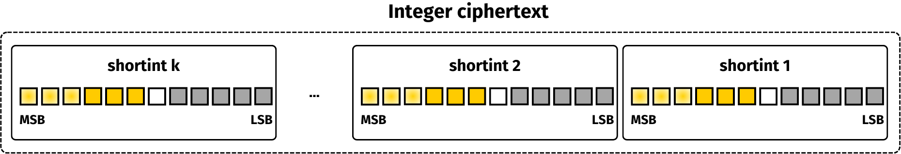

# Operations

The structure and operations related to integers are described in this section.

## How an integer is represented

In `integer`, the encrypted data is split amongst many ciphertexts encrypted with the `shortint` library. Below is a scheme representing an integer composed by k shortint ciphertexts.



This crate implements two ways to represent an integer:

* the Radix representation
* the CRT (Chinese Reminder Theorem) representation

### Radix-based integers.

The first possibility to represent a large integer is to use a Radix-based decomposition on the plaintexts. Let $$B \in \mathbb{N}$$ be a basis such that the size of $$B$$ is smaller than (or equal to) 4 bits. Then, an integer $$m \in \mathbb{N}$$ can be written as $$m = m_0 + m_1*B + m_2*B^2 + ...$$, where each $$m_i$$ is strictly smaller than $$B$$. Each $$m_i$$ is then independently encrypted. In the end, an Integer ciphertext is defined as a set of shortint ciphertexts.

The definition of an integer requires a basis and a number of blocks. This is done at key generation. Below, the keys are dedicated to unsigned integers encrypting messages over 8 bits, using a basis over 2 bits (i.e., $$B=2^2$$) and 4 blocks.

```rust
use tfhe::integer::gen_keys_radix;
use tfhe::shortint::parameters::PARAM_MESSAGE_2_CARRY_2_KS_PBS;

fn main() {
    // We generate a set of client/server keys, using the default parameters:
    let num_block = 4;
    let (client_key, server_key) = gen_keys_radix(PARAM_MESSAGE_2_CARRY_2_KS_PBS, num_block);
}
```

In this representation, the correctness of operations requires the carries to be propagated throughout the ciphertext. This operation is costly, since it relies on the computation of many programmable bootstrapping operations over shortints.

### CRT-based integers.

The second approach to represent large integers is based on the Chinese Remainder Theorem. In this case, the basis $$B$$ is composed of several integers $$b_i$$, such that there are pairwise coprime, and each $$b\_i$$ has a size smaller than 4 bits. The CRT-based integer are defined modulus $$\prod b_i$$. For an integer $$m$$, its CRT decomposition is simply defined as $$m \bmod{b_0}, m \bmod{b_1}, ...$$. Each part is then encrypted as a shortint ciphertext. In the end, an Integer ciphertext is defined as a set of shortint ciphertexts.

In the following example, the chosen basis is $$B = [2, 3, 5]$$. The integer is defined modulus $$2*3*5 = 30$$. There is no need to pre-size the number of blocks since it is determined from the number of values composing the basis. Here, the integer is split over three blocks.

```rust
use tfhe::integer::CrtClientKey;
use tfhe::shortint::parameters::PARAM_MESSAGE_2_CARRY_2_KS_PBS;

fn main() {
    let basis = vec![2, 3, 5];
    let cks = CrtClientKey::new(PARAM_MESSAGE_2_CARRY_2_KS_PBS, basis);
}
```

This representation has many advantages: no carry propagation is required, cleaning the carry buffer of each ciphertext block is enough. This implies that operations can easily be 
parallelized. It also allows the efficient computation of PBS in the case where the function is CRT-compliant.

A variant of the CRT is proposed where each block might be associated to a different key couple. Here, a keychain to the computations is required, but this may result in a performance improvement.

## List of available operations

The list of operations available in `integer` depends on the type of representation:

| Operation name                  | Radix-based          | CRT-based                  |
| ------------------------------  | -------------------- | -------------------------- |
| Negation                        | :heavy\_check\_mark: | :heavy\_check\_mark:       |
| Addition                        | :heavy\_check\_mark: | :heavy\_check\_mark:       |
| Scalar Addition                 | :heavy\_check\_mark: | :heavy\_check\_mark:       |
| Subtraction                     | :heavy\_check\_mark: | :heavy\_check\_mark:       |
| Scalar Subtraction              | :heavy\_check\_mark: | :heavy\_check\_mark:       |
| Multiplication                  | :heavy\_check\_mark: | :heavy\_check\_mark:       |
| Scalar Multiplication           | :heavy\_check\_mark: | :heavy\_check\_mark:       |
| Bitwise OR, AND, XOR            | :heavy\_check\_mark: | :heavy\_check\_mark:       |
| Equality                        | :heavy\_check\_mark: | :heavy\_check\_mark:       |
| Left/Right Shift                | :heavy\_check\_mark: | :heavy\_multiplication\_x: |
| Comparisons `<`,`<=`,`>`, `>=`  | :heavy\_check\_mark: | :heavy\_multiplication\_x: |
| Min, Max                        | :heavy\_check\_mark: | :heavy\_multiplication\_x: |

## Types of operations

Much like `shortint`, the operations available via a `ServerKey` may come in different variants:

* operations that take their inputs as encrypted values.
* scalar operations take at least one non-encrypted value as input.

For example, the addition has both variants:

* `ServerKey::unchecked_add`, which takes two encrypted values and adds them.
* `ServerKey::unchecked_scalar_add`, which takes an encrypted value and a clear value (the so-called scalar) and adds them.

Each operation may come in different 'flavors':

* `unchecked`: always does the operation, without checking if the result may exceed the capacity of the plaintext space.
* `checked`: checks are done before computing the operation, returning an error if operation cannot be done safely.
* `smart`: always does the operation, if the operation cannot be computed safely, the smart operation will propagate the carry buffer to make the operation possible. Some of those will require a mutable reference as input: this is because the inputs' carry might be cleaned, but this will not change the underlying encrypted value.
* `default`: always compute the operation and always clear the carry. Could be **slower** than smart, but ensure that the timings are consistent from one call to another.

Not all operations have these 4 flavors, as some of them are implemented in a way that the operation is always possible without ever exceeding the plaintext space capacity.

## How to use each operation type

Let's try to do a circuit evaluation using the different flavors of already introduced operations. For a very small circuit, the `unchecked` flavor may be enough to do the computation correctly. Otherwise, `checked` and `smart` are the best options.

As an example, let's do a scalar multiplication, a subtraction, and an addition.

```rust
use tfhe::integer::gen_keys_radix;
use tfhe::shortint::parameters::PARAM_MESSAGE_2_CARRY_2_KS_PBS;

fn main() {
    let num_block = 4;
    let (client_key, server_key) = gen_keys_radix(PARAM_MESSAGE_2_CARRY_2_KS_PBS, num_block);

    let msg1 = 12u64;
    let msg2 = 11u64;
    let msg3 = 9u64;
    let scalar = 3u64;

    // message_modulus^vec_length
    let modulus = client_key.parameters().message_modulus().0.pow(num_block as u32) as u64;

    // We use the client key to encrypt two messages:
    let mut ct_1 = client_key.encrypt(msg1);
    let ct_2 = client_key.encrypt(msg2);
    let ct_3 = client_key.encrypt(msg2);

    server_key.unchecked_small_scalar_mul_assign(&mut ct_1, scalar);

    server_key.unchecked_sub_assign(&mut ct_1, &ct_2);

    server_key.unchecked_add_assign(&mut ct_1, &ct_3);

    // We use the client key to decrypt the output of the circuit:
    let output: u64 = client_key.decrypt(&ct_1);
    // The carry buffer has been overflowed, the result is not correct
    assert_ne!(output, ((msg1 * scalar as u64 - msg2) + msg3) % modulus as u64);
}
```

During this computation the carry buffer has been overflowed, and the output may be incorrect as all the operations were `unchecked`.

If the same circuit is done but using the `checked` flavor, a panic will occur:

```rust
use tfhe::integer::gen_keys_radix;
use tfhe::shortint::parameters::PARAM_MESSAGE_2_CARRY_2_KS_PBS;

fn main() {
    let num_block = 2;
    let (client_key, server_key) = gen_keys_radix(PARAM_MESSAGE_2_CARRY_2_KS_PBS, num_block);

    let msg1 = 12u64;
    let msg2 = 11u64;
    let msg3 = 9u64;
    let scalar = 3u64;

    // message_modulus^vec_length
    let modulus = client_key.parameters().message_modulus().0.pow(num_block as u32) as u64;

    // We use the client key to encrypt two messages:
    let mut ct_1 = client_key.encrypt(msg1);
    let ct_2 = client_key.encrypt(msg2);
    let ct_3 = client_key.encrypt(msg3);

    let result = server_key.checked_small_scalar_mul_assign(&mut ct_1, scalar);
    assert!(result.is_ok());

    let result = server_key.checked_sub_assign(&mut ct_1, &ct_2);
    assert!(result.is_err());

    // We use the client key to decrypt the output of the circuit:
    // Only the scalar multiplication could be done
    let output: u64 = client_key.decrypt(&ct_1);
    assert_eq!(output, (msg1 * scalar) % modulus as u64);
}
```

The `checked` flavor permits the manual management of the overflow of the carry buffer by raising an error if correctness is not guaranteed.

Using the `smart` flavor will output the correct result all the time. However, the computation may be slower as the carry buffer may be propagated during the computations.

```rust
use tfhe::integer::gen_keys_radix;
use tfhe::shortint::parameters::PARAM_MESSAGE_2_CARRY_2_KS_PBS;

fn main() {
    let num_block = 4;
    let (client_key, server_key) = gen_keys_radix(PARAM_MESSAGE_2_CARRY_2_KS_PBS, num_block);

    let msg1 = 12u64;
    let msg2 = 11u64;
    let msg3 = 9u64;
    let scalar = 3u64;

    // message_modulus^vec_length
    let modulus = client_key.parameters().message_modulus().0.pow(num_block as u32) as u64;

    // We use the client key to encrypt two messages:
    let mut ct_1 = client_key.encrypt(msg1);
    let mut ct_2 = client_key.encrypt(msg2);
    let mut ct_3 = client_key.encrypt(msg3);

    server_key.smart_scalar_mul_assign(&mut ct_1, scalar);

    server_key.smart_sub_assign(&mut ct_1, &mut ct_2);

    server_key.smart_add_assign(&mut ct_1, &mut ct_3);

    // We use the client key to decrypt the output of the circuit:
    let output: u64 = client_key.decrypt(&ct_1);
    assert_eq!(output, ((msg1 * scalar as u64 - msg2) + msg3) % modulus as u64);
}
```

The main advantage of the default flavor is to ensure predictable timings, as long as only this kind of operation is used. Only the parallelized version of the operations is provided.


Using `default` could **slow down** computations.


```rust
use tfhe::integer::gen_keys_radix;
use tfhe::shortint::parameters::PARAM_MESSAGE_2_CARRY_2_KS_PBS;

fn main() {
    let num_block = 4;
    let (client_key, server_key) = gen_keys_radix(PARAM_MESSAGE_2_CARRY_2_KS_PBS, num_block);

    let msg1 = 12u64;
    let msg2 = 11u64;
    let msg3 = 9u64;
    let scalar = 3u64;

    // message_modulus^vec_length
    let modulus = client_key.parameters().message_modulus().0.pow(num_block as u32) as u64;

    // We use the client key to encrypt two messages:
    let mut ct_1 = client_key.encrypt(msg1);
    let mut ct_2 = client_key.encrypt(msg2);
    let mut ct_3 = client_key.encrypt(msg3);

    server_key.scalar_mul_assign_parallelized(&mut ct_1, scalar);

    server_key.sub_assign_parallelized(&mut ct_1, &mut ct_2);

    server_key.add_assign_parallelized(&mut ct_1, &mut ct_3);

    // We use the client key to decrypt the output of the circuit:
    let output: u64 = client_key.decrypt(&ct_1);
    assert_eq!(output, ((msg1 * scalar as u64 - msg2) + msg3) % modulus as u64);
}
```
