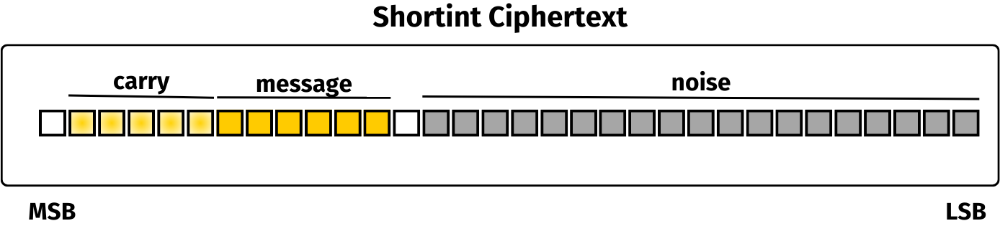

# Operations

The structure and operations related to short integers are described in this section.

## How a shortint is represented

In `shortint`, the encrypted data is stored in an LWE ciphertext.

Conceptually, the message stored in an LWE ciphertext is divided into a **carry buffer** and a **message buffer**.



The message buffer is the space where the actual message is stored. This represents the modulus of the input messages (denoted by `MessageModulus` in the code). When doing computations on a ciphertext, the encrypted message can overflow the message modulus. The part of the message which exceeds the message modulus is stored in the carry buffer. The size of the carry buffer is defined by another modulus, called `CarryModulus`.

Together, the message modulus and the carry modulus form the plaintext space that is available in a ciphertext. This space cannot be overflowed, otherwise the computation may result in an incorrect output.

In order to ensure the correctness of the computation, we track the maximum value encrypted in a ciphertext via an associated attribute called the **degree**. When the degree reaches a defined threshold, the carry buffer may be emptied to safely resume the computations. In `shortint` the carry modulus is considered useful as a means to do more computations.

## Types of operations

The operations available via a `ServerKey` may come in different variants:

* operations that take their inputs as encrypted values
* scalar operations that take at least one non-encrypted value as input

For example, the addition has two variants:

* `ServerKey::unchecked_add`, which takes two encrypted values and adds them.
* `ServerKey::unchecked_scalar_add`, which takes an encrypted value and a clear value (a so-called scalar) and adds them.

Each operation may come in different 'flavors':

* `unchecked`: always does the operation, without checking if the result may exceed the capacity of the plaintext space. Using this operation might have an impact on the correctness of the following operations;
* `checked`: checks are done before computing the operation, returning an error if operation cannot be done safely;
* `smart`: always does the operation. If the operation cannot be computed safely, the smart operation will clear the carry to make the operation possible. Some of those will require a mutable reference as input: this is to allow the modification of the carry, but this will not change the underlying encrypted value;
* `default`: always does the operation and always clears the carry. Could be **slower** than smart, but it ensures that the timings are consistent from one call to another.

Not all operations have these 4 flavors, as some of them are implemented in a way that the operation is always possible without ever exceeding the plaintext space capacity.

## How to use operation types

Let's try to do a circuit evaluation using the different flavors of operations that we have already introduced. For a very small circuit, the `unchecked` flavour may be enough to do the computation correctly. Otherwise,`checked` and `smart` are the best options.

Let's do a scalar multiplication, a subtraction, and a multiplication.

```rust
use tfhe::shortint::prelude::*;


fn main() {
    // We generate a set of client/server keys, using the default parameters:
    let (client_key, server_key) = gen_keys(PARAM_MESSAGE_2_CARRY_2_KS_PBS);

    let msg1 = 3;
    let msg2 = 3;
    let scalar = 4;

    let modulus = client_key.parameters.message_modulus().0;

    // We use the client key to encrypt two messages:
    let mut ct_1 = client_key.encrypt(msg1);
    let ct_2 = client_key.encrypt(msg2);

    server_key.unchecked_scalar_mul_assign(&mut ct_1, scalar);
    server_key.unchecked_sub_assign(&mut ct_1, &ct_2);
    server_key.unchecked_mul_lsb_assign(&mut ct_1, &ct_2);

    // We use the client key to decrypt the output of the circuit:
    let output = client_key.decrypt(&ct_1);
    println!("expected {}, found {}", ((msg1 * scalar as u64 - msg2) * msg2) % modulus as u64, output);
}
```

During this computation, the carry buffer has been overflowed and, as all the operations were `unchecked`, the output may be incorrect.

If we redo this same circuit with the `checked` flavor, a panic will occur:

```rust
use tfhe::shortint::prelude::*;

use std::error::Error;

fn main() {
    // We generate a set of client/server keys, using the default parameters:
    let (client_key, server_key) = gen_keys(PARAM_MESSAGE_2_CARRY_2_KS_PBS);

    let msg1 = 3;
    let msg2 = 3;
    let scalar = 4;

    let modulus = client_key.parameters.message_modulus().0;

    // We use the client key to encrypt two messages:
    let mut ct_1 = client_key.encrypt(msg1);
    let ct_2 = client_key.encrypt(msg2);

    let mut ops = || -> Result<(), Box<dyn Error>> {
        server_key.checked_scalar_mul_assign(&mut ct_1, scalar)?;
        server_key.checked_sub_assign(&mut ct_1, &ct_2)?;
        server_key.checked_mul_lsb_assign(&mut ct_1, &ct_2)?;
        Ok(())
    };

    match ops() {
        Ok(_) => (),
        Err(e) => {
            println!("correctness of operations is not guaranteed due to error: {}", e);
            return;
        },
    }

    // We use the client key to decrypt the output of the circuit:
    let output = client_key.decrypt(&ct_1);
    assert_eq!(output, ((msg1 * scalar as u64 - msg2) * msg2) % modulus as u64);
}
```

The `checked` flavor permits manual management of the overflow of the carry buffer by raising an error if correctness is not guaranteed.

Using the `smart` flavor will output the correct result all the time. However, the computation may be slower as the carry buffer may be cleaned during the computations.

```rust
use tfhe::shortint::prelude::*;


fn main() {
    // We generate a set of client/server keys, using the default parameters:
    let (client_key, server_key) = gen_keys(PARAM_MESSAGE_2_CARRY_2_KS_PBS);

    let msg1 = 3;
    let msg2 = 3;
    let scalar = 4;

    let modulus = client_key.parameters.message_modulus().0;

    // We use the client key to encrypt two messages:
    let mut ct_1 = client_key.encrypt(msg1);
    let mut ct_2 = client_key.encrypt(msg2);

    server_key.smart_scalar_mul_assign(&mut ct_1, scalar);
    server_key.smart_sub_assign(&mut ct_1, &mut ct_2);
    server_key.smart_mul_lsb_assign(&mut ct_1, &mut ct_2);

    // We use the client key to decrypt the output of the circuit:
    let output = client_key.decrypt(&ct_1);
    assert_eq!(output, ((msg1 * scalar as u64 - msg2) * msg2) % modulus as u64);
}
```

The  main advantage of the default flavor is to ensure predictable timings as long as this is the only kind of operation which is used.


Using `default` could **slow-down** computations.


```rust
use tfhe::shortint::prelude::*;


fn main() {
    // We generate a set of client/server keys, using the default parameters:
    let (client_key, server_key) = gen_keys(PARAM_MESSAGE_2_CARRY_2_KS_PBS);

    let msg1 = 3;
    let msg2 = 3;
    let scalar = 4;

    let modulus = client_key.parameters.message_modulus().0;

    // We use the client key to encrypt two messages:
    let mut ct_1 = client_key.encrypt(msg1);
    let mut ct_2 = client_key.encrypt(msg2);

    server_key.scalar_mul_assign(&mut ct_1, scalar);
    server_key.sub_assign(&mut ct_1, &mut ct_2);
    server_key.mul_lsb_assign(&mut ct_1, &mut ct_2);

    // We use the client key to decrypt the output of the circuit:
    let output = client_key.decrypt(&ct_1);
    assert_eq!(output, ((msg1 * scalar as u64 - msg2) * msg2) % modulus as u64);
}
```

\#List of available operations


Certain operations can only be used if the parameter set chosen is compatible with the bivariate programmable bootstrapping, meaning the carry buffer is larger than or equal to the message buffer. These operations are marked with a star (\*).


The list of implemented operations for shortint is:

* addition between two ciphertexts
* addition between a ciphertext and an unencrypted scalar
* comparisons `<`, `<=`, `>`, `>=`, `==`, `!=` between a ciphertext and an unencrypted scalar
* division of a ciphertext by an unencrypted scalar
* LSB multiplication between two ciphertexts returning the result truncated to fit in the `message buffer`
* multiplication of a ciphertext by an unencrypted scalar
* bitwise shift `<<`, `>>`
* subtraction of a ciphertext by another ciphertext
* subtraction of a ciphertext by an unencrypted scalar
* negation of a ciphertext
* bitwise and, or and xor (\*)
* comparisons `<`, `<=`, `>`, `>=`, `==`, `!=` between two ciphertexts (\*)
* division between two ciphertexts (\*)
* MSB multiplication between two ciphertexts returning the part overflowing the `message buffer` (\*)

### Public key encryption.

TFHE-rs supports both private and public key encryption methods. The only difference between both lies in the encryption step: in this case, the encryption method is called using `public_key` instead of `client_key`.

Here is a small example on how to use public encryption:

```rust
use tfhe::shortint::prelude::*;

fn main() {
    // Generate the client key and the server key:
    let (cks, _) = gen_keys(PARAM_MESSAGE_2_CARRY_2_KS_PBS);
    let pks = PublicKey::new(&cks);

    let msg = 2;
    // Encryption of one message:
    let ct = pks.encrypt(msg);
    // Decryption:
    let dec = cks.decrypt(&ct);
    assert_eq!(dec, msg);
}
```

### Arithmetic operations.

Classical arithmetic operations are supported by shortint:

```rust
use tfhe::shortint::prelude::*;

fn main() {
    // We generate a set of client/server keys to compute over Z/2^2Z, with 2 carry bits
    let (client_key, server_key) = gen_keys(PARAM_MESSAGE_2_CARRY_2_KS_PBS);

    let msg1 = 2;
    let msg2 = 1;

    let modulus = client_key.parameters.message_modulus().0;

    // We use the private client key to encrypt two messages:
    let ct_1 = client_key.encrypt(msg1);
    let ct_2 = client_key.encrypt(msg2);

    // We use the server public key to execute an integer circuit:
    let ct_3 = server_key.unchecked_add(&ct_1, &ct_2);

    // We use the client key to decrypt the output of the circuit:
    let output = client_key.decrypt(&ct_3);
    assert_eq!(output, (msg1 + msg2) % modulus as u64);
}
```

#### bitwise operations

Short homomorphic integer types support some bitwise operations.

A simple example on how to use these operations:

```rust
use tfhe::shortint::prelude::*;

fn main() {
    // We generate a set of client/server keys to compute over Z/2^2Z, with 2 carry bits
    let (client_key, server_key) = gen_keys(PARAM_MESSAGE_2_CARRY_2_KS_PBS);

    let msg1 = 2;
    let msg2 = 1;

    let modulus = client_key.parameters.message_modulus().0;

    // We use the private client key to encrypt two messages:
    let ct_1 = client_key.encrypt(msg1);
    let ct_2 = client_key.encrypt(msg2);

    // We use the server public key to homomorphically compute a bitwise AND:
    let ct_3 = server_key.unchecked_bitand(&ct_1, &ct_2);

    // We use the client key to decrypt the output of the circuit:
    let output = client_key.decrypt(&ct_3);
    assert_eq!(output, (msg1 & msg2) % modulus as u64);
}
```

#### comparisons

Short homomorphic integer types support comparison operations.

A simple example on how to use these operations:

```rust
use tfhe::shortint::prelude::*;

fn main() {
    // We generate a set of client/server keys to compute over Z/2^2Z, with 2 carry bits
    let (client_key, server_key) = gen_keys(PARAM_MESSAGE_2_CARRY_2_KS_PBS);

    let msg1 = 2;
    let msg2 = 1;

    let modulus = client_key.parameters.message_modulus().0;

    // We use the private client key to encrypt two messages:
    let ct_1 = client_key.encrypt(msg1);
    let ct_2 = client_key.encrypt(msg2);

    // We use the server public key to execute an integer circuit:
    let ct_3 = server_key.unchecked_greater_or_equal(&ct_1, &ct_2);

    // We use the client key to decrypt the output of the circuit:
    let output = client_key.decrypt(&ct_3);
    assert_eq!(output, (msg1 >= msg2) as u64 % modulus as u64);
}
```

#### univariate function evaluations

A simple example on how to use this operation to homomorphically compute the hamming weight (i.e., the number of bits equal to one) of an encrypted number.

```rust
use tfhe::shortint::prelude::*;

fn main() {
    // We generate a set of client/server keys to compute over Z/2^2Z, with 2 carry bits
    let (client_key, server_key) = gen_keys(PARAM_MESSAGE_2_CARRY_2_KS_PBS);

    let msg1 = 3;

    let modulus = client_key.parameters.message_modulus().0;

    // We use the private client key to encrypt two messages:
    let ct_1 = client_key.encrypt(msg1);

    let acc = server_key.generate_lookup_table(|n| n.count_ones().into());

    // add the two ciphertexts
    let ct_res = server_key.apply_lookup_table(&ct_1, &acc);


    // We use the client key to decrypt the output of the circuit:
    let output = client_key.decrypt(&ct_res);
    assert_eq!(output, msg1.count_ones() as u64);
}
```

#### bi-variate function evaluations

Using the shortint types offers the possibility to evaluate bi-variate functions, or functions that take two ciphertexts as input. This requires choosing a parameter set such that the carry buffer size is at least as large as the message (i.e., PARAM\_MESSAGE\_X\_CARRY\_Y with X <= Y).

Here is a simple code example:

```rust
use tfhe::shortint::prelude::*;

fn main() {
    // We generate a set of client/server keys to compute over Z/2^2Z, with 2 carry bits
    let (client_key, server_key) = gen_keys(PARAM_MESSAGE_2_CARRY_2_KS_PBS);

    let msg1 = 3;
    let msg2 = 2;

    let modulus = client_key.parameters.message_modulus().0 as u64;

    // We use the private client key to encrypt two messages:
    let ct_1 = client_key.encrypt(msg1);
    let mut ct_2 = client_key.encrypt(msg2);

    // Compute the lookup table for the bivariate functions
    let acc = server_key.generate_lookup_table_bivariate(|x,y| (x.count_ones()
        + y.count_ones()) as u64 % modulus );

    let ct_res = server_key.smart_apply_lookup_table_bivariate(&ct_1, &mut ct_2, &acc);

    // We use the client key to decrypt the output of the circuit:
    let output = client_key.decrypt(&ct_res);
    assert_eq!(output, (msg1.count_ones() as u64 + msg2.count_ones() as u64) % modulus);
}
```
