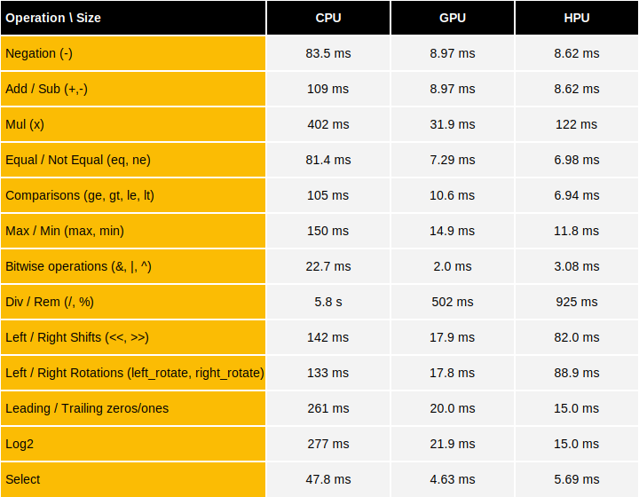

# Benchmarks

This document summarizes the timings of some homomorphic operations over 64-bit encrypted integers, depending on the hardware. More details are given for [the CPU](cpu/README.md), [the GPU](gpu/README.md), [the HPU](hpu/README.md) or [zeros-knowledge proofs](zk-proof-benchmarks.md).

The cryptographic parameters used for benchmarking follow a tweaked uniform (TUniform) noise distribution instead of a Gaussian. The main advantage of this distribution is to be bounded, whereas the usual Gaussian one is not. In some practical cases, this can simplify the use of homomorphic computation. See the [noise section](../security-and-cryptography.md#noise) of the Security and cryptography documentation page for more information on the noise distributions.

You can get the parameters used for benchmarks by cloning the repository and checking out the commit you want to use (starting with the v0.8.0 release) and run the following make command:

```console
make print_doc_bench_parameters
```

### Operation latency CPU vs GPU comparison


Benchmarks in the Table below were launched on: 
 * CPU: using an `AWS hpc7a.96xlarge` instance equipped with a 96-core `AMD EPYC 9R14 CPU @ 2.60GHz` and 740GB of RAM
 * GPU: using 8xH100 GPU, and rely on the multithreaded PBS algorithm
 * HPU: using 1xv80 Alveo board



