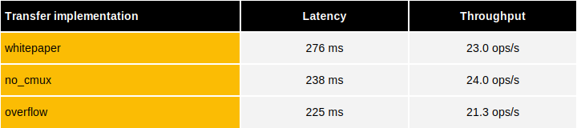

As TFHE-rs is the underlying library of the Zama Confidential Blockchain Protocol, to illustrate real-world performance,  
consider an ERC20 transfer that requires executing the following sequence of operations:
```rust
use tfhe::FheUint64;
use tfhe::prelude::FheOrd;
use tfhe::prelude::FheTrivialEncrypt;
use tfhe::prelude::IfThenElse;
#[allow(dead_code)]
fn erc20_transfer_whitepaper(
    from_amount: &FheUint64,
    to_amount: &FheUint64,
    amount: &FheUint64,
) -> (FheUint64, FheUint64) {
    let has_enough_funds = (from_amount).ge(amount);
    let zero_amount = FheUint64::encrypt_trivial(0u64);
    let amount_to_transfer = has_enough_funds.select(amount, &zero_amount);

    let new_to_amount = to_amount + &amount_to_transfer;
    let new_from_amount = from_amount - &amount_to_transfer;

    (new_from_amount, new_to_amount)
}
```
This is one way to compute an encrypted ERC20 transfer, but it is not the most efficient.
Instead, it is possible to compute the same transfer in a more efficient way by not using the `select` operation:
```rust
use tfhe::FheUint64;
use tfhe::prelude::FheOrd;
use tfhe::prelude::CastFrom;
#[allow(dead_code)]
fn erc20_transfer_no_cmux(
    from_amount: &FheUint64,
    to_amount: &FheUint64,
    amount: &FheUint64,
) -> (FheUint64, FheUint64) {
    let has_enough_funds = (from_amount).ge(amount);

    let amount = amount * FheUint64::cast_from(has_enough_funds);

    let new_to_amount = to_amount + &amount;
    let new_from_amount = from_amount - &amount;

    (new_from_amount, new_to_amount)
}
```
An even more efficient way to compute an encrypted ERC20 transfer is to use the `overflowing_sub` operation as follows:
```rust
use tfhe::FheUint64;
use tfhe::prelude::OverflowingSub;
use tfhe::prelude::CastFrom;
use tfhe::prelude::IfThenElse;
#[allow(dead_code)]
fn erc20_transfer_overflow(
    from_amount: &FheUint64,
    to_amount: &FheUint64,
    amount: &FheUint64,
) -> (FheUint64, FheUint64) {
    let (new_from, did_not_have_enough) = (from_amount).overflowing_sub(amount);
    let did_not_have_enough = &did_not_have_enough;
    let had_enough_funds = !did_not_have_enough;

    let (new_from_amount, new_to_amount) = rayon::join(
        || did_not_have_enough.select(from_amount, &new_from),
        || to_amount + (amount * FheUint64::cast_from(had_enough_funds)),
    );
    (new_from_amount, new_to_amount)
}
```
In a blockchain protocol, the FHE operations would not be the only ones used to compute the transfer:
ciphertext compression and decompression, as well as rerandomization, would also be used. 
Network communications would also introduce significant overhead.
For the sake of simplicity, here the focus is only placed on the performance of the FHE operations.
The latency and throughput of these three ERC20 FHE transfer implementations are compared in the following table:



The throughput shown here is the maximum that can be achieved with TFHE-rs on CPU, in an ideal scenario where all transactions are independent. 
In a blockchain protocol, the throughput would be limited by the latency of the network, but also by the necessity to apply other operations 
(compression, decompression, ciphertext rerandomization).
