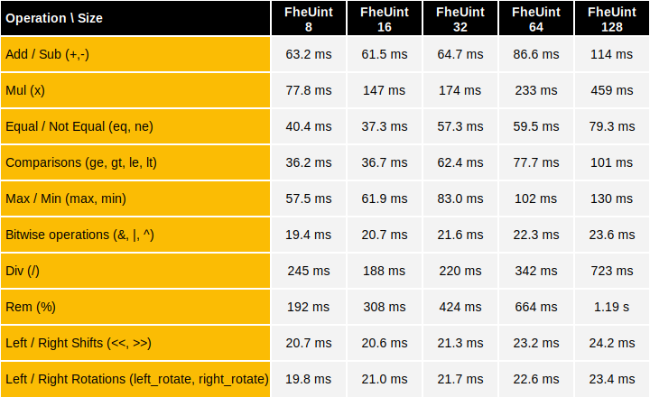

# Integer Operations over CPU

This document details the CPU performance benchmarks of homomorphic operations on integers using **TFHE-rs**.

By their nature, homomorphic operations run slower than their cleartext equivalents.


All CPU benchmarks were launched on an `AWS hpc7a.96xlarge` instance equipped with a 96-core `AMD EPYC 9R14 CPU @ 2.60GHz` and 740GB of RAM.


The following tables benchmark the execution time of some operation sets using `FheUint` (unsigned integers). The `FheInt` (signed integers) performs similarly.

## Pfail: $$2^{-128}$$

The next table shows the operation timings on CPU when all inputs are encrypted:


The next table shows the operation timings on CPU when the left input is encrypted and the right is a clear scalar of the same size:



All timings are based on parallelized Radix-based integer operations where each block is encrypted using the default parameters `PARAM_MESSAGE_2_CARRY_2_KS_PBS`. To ensure predictable timings, we perform operations in the `default` mode, which ensures that the input and output encoding are similar (i.e., the carries are always emptied).

You can minimize operational costs by selecting from 'unchecked', 'checked', or 'smart' modes from [the fine-grained APIs](../../../references/fine-grained-apis/quick-start.md), each balancing performance and correctness differently. For more details about parameters, see [here](../../../references/fine-grained-apis/shortint/parameters.md). You can find the benchmark results on GPU for all these operations on GPU [here](../../../getting-started/benchmarks/gpu/README.md) and on HPU [here](../../../configuration/hpu-acceleration/benchmark.md).

## Reproducing TFHE-rs benchmarks

**TFHE-rs** benchmarks can be easily reproduced from the [source](https://github.com/zama-ai/tfhe-rs).


AVX512 is now enabled by default for benchmarks when available


The following example shows how to reproduce **TFHE-rs** benchmarks:

```shell
#Integer benchmarks:
make bench_integer
```
