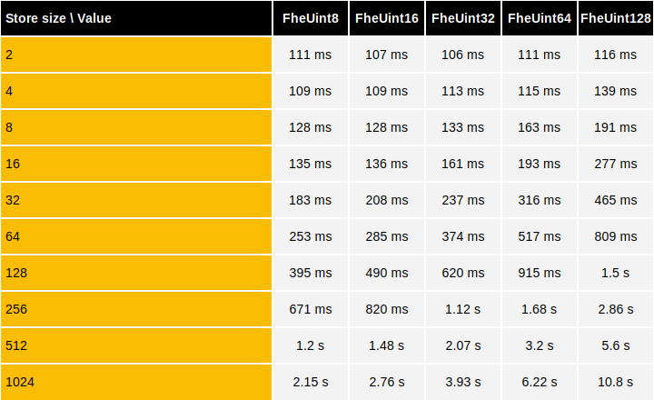
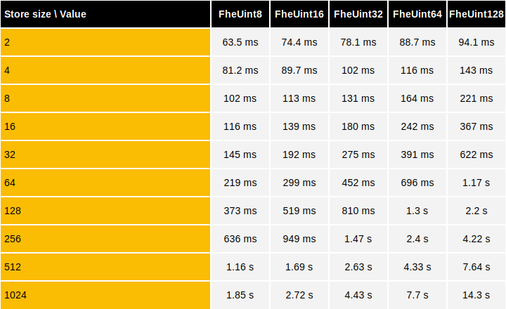
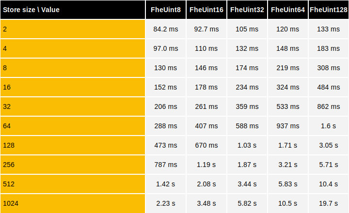

# Key-Value Store Operations over CPU

The Key-Value Store (KVStore) is a specialized encrypted HashMap where:

* Keys are clear numbers
* Values are `FheInt`  (signed integers) or `FheUint`  (unsigned integers)

This document details the CPU performance benchmarks of homomorphic operations on KVStore with encrypted keys using **TFHE-rs**.


All CPU benchmarks were launched on an `AWS hpc7a.96xlarge` instance equipped with two 96-core `AMD EPYC 9R14 CPU @ 2.60GHz` and 740GB of RAM.


The following tables benchmark the execution time of operations using `FheUint`.

## Get latency

The next table shows the operation timings on CPU to get the value corresponding to an encrypted key.



## Update latency

The next table shows the operation timings on CPU to replace the value corresponding to an encrypted key.



## Map latency

The next table shows the operation timings on CPU to replace the value corresponding to an encrypted key, with the result of applying the identity function to the current value.



## Reproducing TFHE-rs benchmarks

**TFHE-rs** benchmarks can be easily reproduced from the [source](https://github.com/zama-ai/tfhe-rs).


AVX512 is now enabled by default for benchmarks when available


The following example shows how to reproduce **TFHE-rs** benchmarks:

```shell
#Key-value Store benchmarks:
make bench_hlapi_kvstore
```
