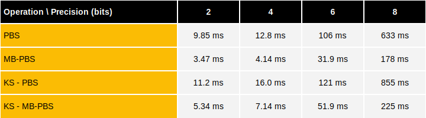
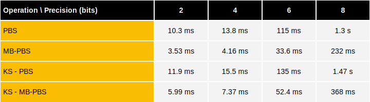

# Programmable bootstrapping over CPU

This document details the CPU performance benchmarks of programmable bootstrapping and keyswitch operations using **TFHE-rs**.


All CPU benchmarks were launched on an `AWS hpc7a.96xlarge` instance equipped with a 96-core `AMD EPYC 9R14 CPU @ 2.60GHz` and 740GB of RAM.


The next tables show the execution time of a single programmable bootstrapping as well as keyswitch followed by a programmable bootstrapping depending on the precision of the input message. The associated parameters set are given. The configuration is tfhe-fft + AVX-512.

Note that these benchmarks use Gaussian parameters. `MB-PBS` stands for multi-bit programmable bootstrapping with a grouping factor set to 4.

## P-fail: $$2^{-64}$$



## P-fail: $$2^{-128}$$



## Reproducing TFHE-rs benchmarks

**TFHE-rs** benchmarks can be easily reproduced from the [source](https://github.com/zama-ai/tfhe-rs).


AVX512 is now enabled by default for benchmarks when available


The following example shows how to reproduce **TFHE-rs** benchmarks:

```shell
#PBS benchmarks:
make bench_pbs

#KS-PBS benchmarks:
make bench_ks_pbs
```
