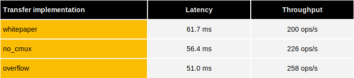

Similarly to the [CPU benchmarks](../cpu/cpu-erc20.md), the latency and throughput of a confidential ERC20 token transfer can be measured.

The throughput shown here is the maximum that can be achieved with TFHE-rs on an 8xH100 GPU node, in an ideal scenario where all transactions are independent.
In a blockchain protocol, the throughput would be limited by the latency of the network and the necessity to apply 
other operations (compression, decompression, rerandomization).
