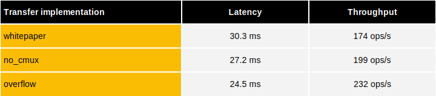

Similarly to the [CPU benchmarks](../cpu/cpu-erc7984.md), the latency and throughput of a confidential ERC7984 token transfer can be measured. 
Because the GPU supports both flavors of the PBS, i.e., the classical (sequential) and the parallelized version, we provide benchmarks for each. 
The throughput shown here is the maximum that can be achieved with TFHE-rs on an 8xH100 GPU node, in an ideal scenario where all transactions are independent.

## Sequential Bootstrapping based ERC7984 

## Parallelized Bootstrapping based ERC7984

