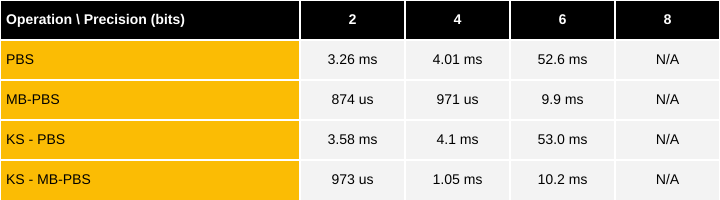
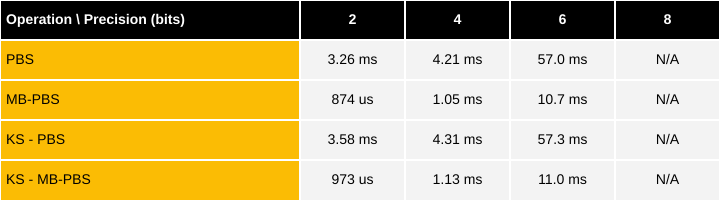

# Programmable bootstrapping over GPU

This document details the GPU performance benchmarks of programmable bootstrapping and keyswitch operations using **TFHE-rs**.


All GPU benchmarks were launched on H100 GPUs, and rely on the multithreaded PBS algorithm with a grouping factor set to 4 for the MB variant. The PBS variant is the classic algorithm.
Note that the $$2^{-64}$$ 2 bits parameters are the same as the $$2^{-128}$$ parameters, they are specifically optimized for GPU and yield better performance than previous generic $$2^{-64}$$ parameters.


## P-fail: $$2^{-64}$$



## P-fail: $$2^{-128}$$



## Reproducing TFHE-rs benchmarks

**TFHE-rs** benchmarks can be easily reproduced from the [source](https://github.com/zama-ai/tfhe-rs).

The following example shows how to reproduce **TFHE-rs** benchmarks:

```shell
#PBS benchmarks:
make bench_pbs_gpu

#KS-PBS benchmarks:
make bench_ks_pbs_gpu
```
