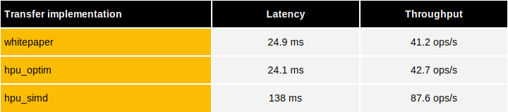

Similarly to the [CPU benchmarks](../cpu/cpu-erc20.md), the latency and throughput of a confidential ERC20 token transfer can be measured.

The whitepaper version of the ERC20 is the same implementation than on CPU or GPU using a selection between the amount to be transferred and 0 based on result of comparison between this amount and from_amount followed by an addition and a subtraction. The hpu_optim version is very much the same processing but with a single HPU instruction (IOp) doing the complete ERC20 processing.

The hpu_simd version is a different measure which uses another HPU IOp called ERC20_SIMD (for Single Instruction Multiple Data). This ERC20_SIMD takes an input of 12 triplets (from, to, amount) and returns 12 pairs (new_from, new_to) and is particulartly efficient when having many independent transfers to execute.

The throughput shown here is the maximum that can be achieved with TFHE-rs on a single FPGA node running the HPU, in an ideal scenario where all transactions are independent.
In a blockchain protocol, the throughput would be limited by the latency of the network and the necessity to apply other operations (compression, decompression, rerandomization).
