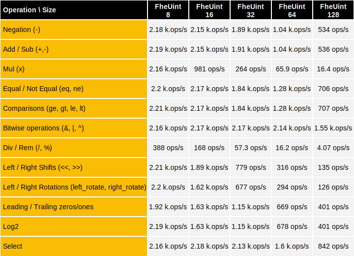
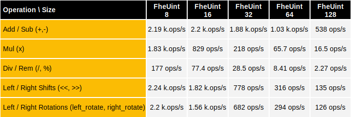
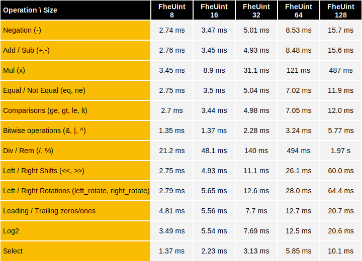
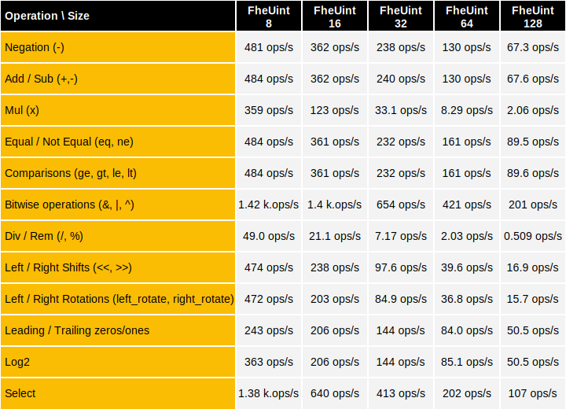
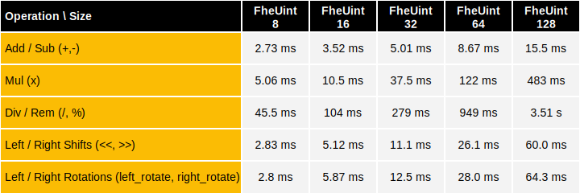
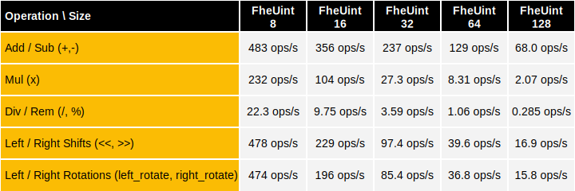

# Integer Operations over HPU

This document details the HPU performance benchmarks of homomorphic operations on integers using **TFHE-rs**.


All HPU benchmarks were launched on AMD Alveo v80 FPGAs.


The cryptographic parameters `HPU_PARAM_MESSAGE_2_CARRY_2_KS32_PBS_TUNIFORM_2M128` were used.

## 8xHPU
Below are the execution results for a cluster of 8x Alveo v80 boards.
Currently, the [Zama HPU Compiler](https://github.com/zama-ai/zhc) does not automatically split large operations across multiple HPU, though we can manually split large operations (such as multiplication) across 2 to 4 HPU. Because of this limitation, the latency on an 8x HPU cluster is currently identical to that of a single HPU. Consequently, the data below highlights only the operation throughput of the 8x HPU cluster.

### Encrypted/encrypted operations throughput



### Encrypted/clear operations throughput



## 1xHPU
Below are the results for the execution on a single Alveo v80 board.

The following tables show the performance when the inputs of the benchmarked operation are encrypted:

### Encrypted/encrypted operations latency



### Encrypted/encrypted operations throughput



The following tables show the performance when the left input of the benchmarked operation is encrypted and the other is a clear scalar of the same size:

### Encrypted/clear operations latency



### Encrypted/clear operations throughput



## Reproducing TFHE-rs benchmarks

**TFHE-rs** benchmarks can be easily reproduced from the [source](https://github.com/zama-ai/tfhe-rs).

The following example shows how to reproduce **TFHE-rs** benchmarks:

```shell
#Integer benchmarks:
make bench_integer_hpu
```
