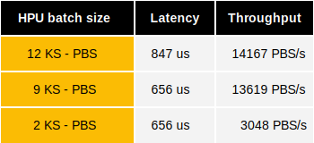

# Programmable bootstrapping over HPU

This document details the HPU performance benchmarks of programmable bootstrapping and keyswitch operations using **TFHE-rs**.


All HPU benchmarks were launched on AMD Alveo v80 FPGAs.


The cryptographic parameters `HPU_PARAM_MESSAGE_2_CARRY_2_KS32_PBS_TUNIFORM_2M128` were used.

The HPU interface is based on IOp (Integer Operations) execution and is not designed to execute a single PBS. That is why the following measurements were done by building custom IOp containing only PBS. The HPU executes PBS by batch to share key elements between several ciphertexts and optimize processing pipeline usage. It also executes the keyswitch in parallel of the blind-rotation of the PBS so the 2 operations cannot be separated.
The next table shows the execution time of batches of 12, 9 and 2 KS-PBS.

## P-fail: $$2^{-128}$$



It can be noticed that while maximizing size of batches does maximize PBS throughput, it does not minimize PBS latency.

## Reproducing TFHE-rs benchmarks

**TFHE-rs** benchmarks can be easily reproduced from the [source](https://github.com/zama-ai/tfhe-rs).

To get the numbers listed above we use the latency of custom operations executing 10k PBS batches and check these values using internal trace system that measures number of clock cycles taken by each PBS batch. The HPU internal trace system is described in [HPU debug IOp documentation](https://github.com/zama-ai/hpu_fpga/blob/main/docs/debug.md).
The following example shows how to reproduce HPU PBS measurements:

```shell
# compile the HPU debug utility
cargo build --profile devo --features hpu,utils,hw-v80 --bin hputil
# run the custom IOp
cargo run --profile devo --features=integer,internal-keycache,hw-v80 --example hpu_bench -- --integer-w 128 --iop "IOP[15]" --user-proto "<N>::<N><0>"
...
________________________________________
Benchmark report for Integer_128:
 IOP[0xf] -> 8.47574472s
...
# dump the trace (dump time of trace can be reduced in hpu_config.toml by reducing number of words dumped in trace_depth parameter)
./target/devo/hputil trace-dump -f trace_10000batch12.json
# using python example in backends/tfhe-hpu-backend/python
cd backends/tfhe-hpu-backend/python
export PYTHONPATH=$(readlink -m ./lib)
python -m venv new_env
source new_env/bin/activate
pip3 install -r requirements.txt
cp ../../../trace_10000batch12.json ./data/trace.json
./bin/demo.py
...
               min         avg       max         sum  count
batch size                                                 
12          843.85  846.944241  870.4275  8469442.41  10000
batches: 10000
Runtime: 8469452.0us
```
