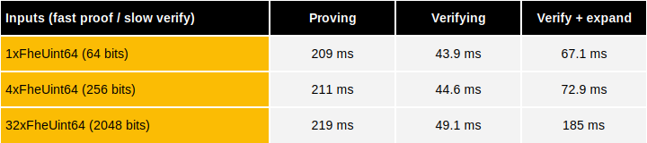
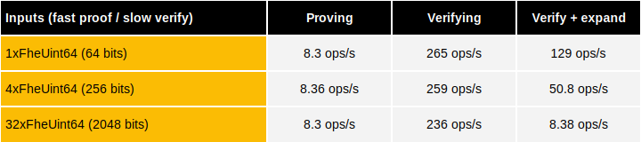
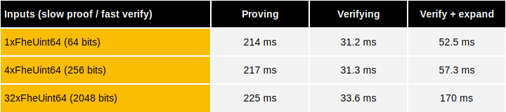
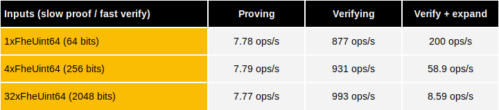
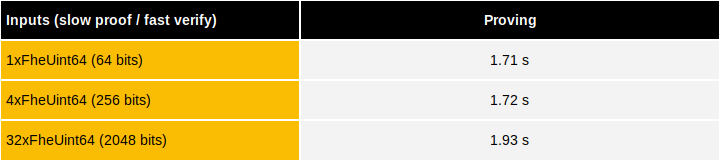

# Zero-knowledge proof benchmarks

This document details the performance benchmarks of [zero-knowledge proofs](../../fhe-computation/advanced-features/zk-pok.md) for [compact public key encryption](../../fhe-computation/advanced-features/public-key.md) using **TFHE-rs**.

## Server-side computation


Benchmarks were launched on an `AWS hpc7a.96xlarge` instance equipped with two 96-core `AMD EPYC 9R14 CPU @ 2.60GHz` and 740GB of RAM.


Proving and verification are done with tfhe-rs native executable on a powerful server.

### Fast proof / slow verify latency

### Fast proof / slow verify throughput

### Slow proof / fast verify latency

### Slow proof / fast verify throughput

## Client-side computation


Benchmarks were launched on an `AWS m6i.4xlarge` instance equipped with a 16-core from a hypervisored `Intel Xeon Platinum 8375C CPU @ 2.90GHz` and 64GB of RAM.


Proving is done on a 16-core machine using WASM executable run on a Chrome browser to simulate a typical client configuration.

### Fast proof / slow verify latency

### Slow proof / fast verify latency

