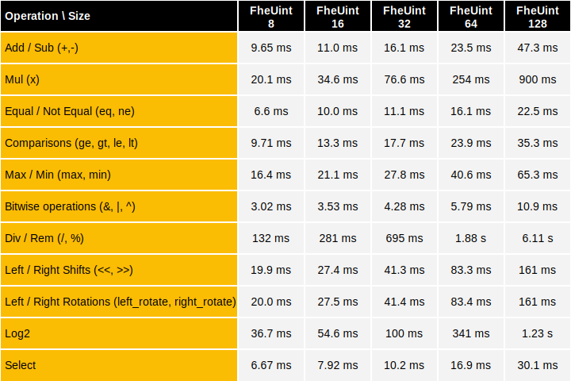
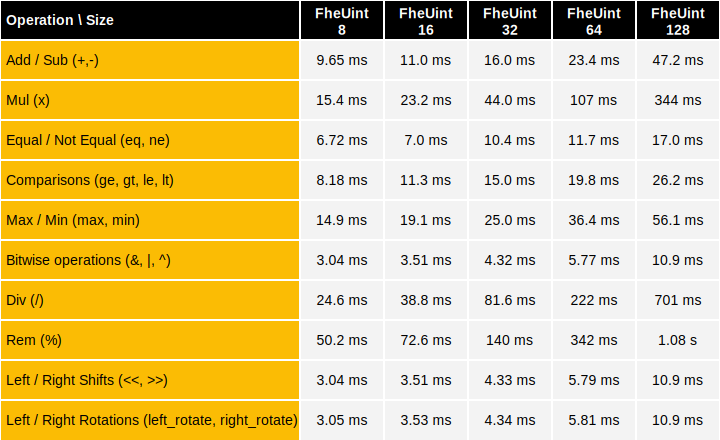
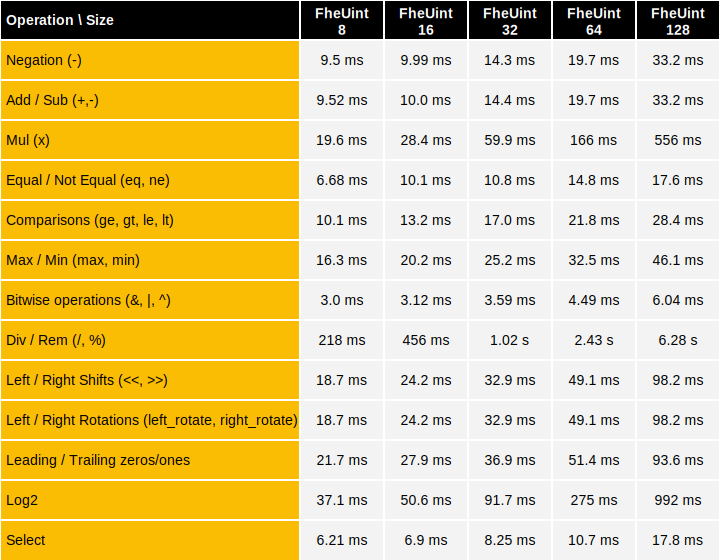

# Integer Operations over GPU

This document details the GPU performance benchmarks of homomorphic operations on integers using **TFHE-rs**.


All GPU benchmarks were launched on H100 GPUs, and rely on the multithreaded PBS algorithm.


The cryptographic parameters `PARAM_GPU_MULTI_BIT_GROUP_4_MESSAGE_2_CARRY_2_KS_PBS` were used.

## Pfail: $$2^{-128}$$
### 1xH100
Below come the results for the execution on a single H100.
The following table shows the performance when the inputs of the benchmarked operation are encrypted:



The following table shows the performance when the left input of the benchmarked operation is encrypted and the other is a clear scalar of the same size:



### 2xH100

Below come the results for the execution on two H100's.
The following table shows the performance when the inputs of the benchmarked operation are encrypted:



The following table shows the performance when the left input of the benchmarked operation is encrypted and the other is a clear scalar of the same size:


## Reproducing TFHE-rs benchmarks

**TFHE-rs** benchmarks can be easily reproduced from the [source](https://github.com/zama-ai/tfhe-rs).

The following example shows how to reproduce **TFHE-rs** benchmarks:

```shell
#Integer benchmarks:
make bench_integer_gpu
```
