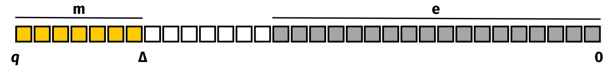

# Security and Cryptography

## TFHE

`TFHE-rs` is a cryptographic library dedicated to Fully Homomorphic Encryption. As its name suggests, it is based on the TFHE scheme.

It is necessary to understand some basics about TFHE in order to consider the limitations. Of particular importance are the precision (number of bits used to represent plaintext values) and execution time (why TFHE operations are slower than native operations).

## LWE ciphertexts

Although there are many kinds of ciphertexts in TFHE, all of the encrypted values in `TFHE-rs` are mainly stored as LWE ciphertexts.

The security of TFHE relies on the LWE problem, which stands for Learning With Errors. The problem is believed to be secure against quantum attacks.

An LWE Ciphertext is a collection of 32-bit or 64-bit unsigned integers. Before encrypting a message in an LWE ciphertext, one must first encode it as a plaintext. This is done by shifting the message to the most significant bits of the unsigned integer type used.

Then, a small random value called noise is added to the least significant bits. This noise is crucial in ensuring the security of the ciphertext.

$$plaintext = (\Delta * m) + e$$

$$m \in \mathbb{Z}_p$$

To go from a **plaintext** to a **ciphertext,** one must encrypt the plaintext using a secret key.

An LWE secret key is a list of `n` random integers: $$S = (s_0, ..., s_{n-1})$$. $$n$$ is called the $$LweDimension$$

An LWE ciphertext is composed of two parts:

* The mask $$(a_0, ..., a_{n-1})$$
* The body $$b$$

The mask of a _fresh_ ciphertext (one that is the result of an encryption, and not of an operation such as ciphertext addition) is a list of `n` uniformly random values.

The body is computed as follows:

$$b = (\sum_{i = 0}^{n-1}{a_i * s_i}) + plaintext$$

Now that the encryption scheme is defined, let's review the example of the addition between ciphertexts to illustrate why it is slower to compute over encrypted data.

To add two ciphertexts, we must add their $mask$ and $body$:

$$
ct_0 = (a_{0}, ..., a_{n-1}, b) \\ ct_1 = (a_{0}^{\prime}, ..., a_{n-1}^{\prime}, b^{\prime}) \\ ct_{2} = ct_0 + ct_1 \\ ct_{2} = (a_{0} + a_{0}^{\prime}, ..., a_{n-1} + a_{n-1}^{\prime}, b + b^{\prime})\\ b + b^{\prime} = (\sum_{i = 0}^{n-1}{a_i * s_i}) + plaintext + (\sum_{i = 0}^{n-1}{a_i^{\prime} * s_i}) + plaintext^{\prime}\\ b + b^{\prime} = (\sum_{i = 0}^{n-1}{(a_i + a_i^{\prime})* s_i}) + \Delta m + \Delta m^{\prime} + e + e^{\prime}\\
$$

To add ciphertexts, it is sufficient to add their masks and bodies. Instead of just adding two integers, one needs to add $$n + 1$$ elements. This is an intuitive example to show the slowdown of FHE computation compared to plaintext computation, but other operations are far more expensive (e.g., the computation of a lookup table using Programmable Bootstrapping).

## Programmable Bootstrapping, noise management and carry bits

In FHE, there are two types of operations that can be applied to ciphertexts:

* **leveled operations**, which increase the noise in the ciphertext
* **bootstrapped operations**, which reduce the noise in the ciphertext

In FHE, noise must be tracked and managed to guarantee the correctness of the computation.

Bootstrapping operations are used across the computation to decrease noise within the ciphertexts, preventing it from tampering with the message. The rest of the operations are called leveled because they do not need bootstrapping operations and are usually very fast as a result.

The following sections explain the concept of noise and padding in ciphertexts.

### Noise.

For it to be secure, LWE requires random noise to be added to the message at encryption time.

In TFHE, this random noise is drawn from a Centered Normal Distribution, parameterized by a standard deviation. The chosen standard deviation has an impact on the security level. With everything else fixed, increasing the standard deviation will lead to an increase in the security level.

In `TFHE-rs`, noise is encoded in the least significant bits of each plaintext. Each leveled computation increases the value of the noise. If too many computations are performed, the noise will eventually overflow into the message bits and lead to an incorrect result.

The figure below illustrates this problem in the case of an addition, where an extra bit of noise is incurred as a result.

`TFHE-rs` offers the ability to automatically manage noise by performing bootstrapping operations to reset the noise.

### Programmable BootStrapping (PBS)

The bootstrapping of TFHE has the particularity of being programmable: this means that any function can be homomorphically computed over an encrypted input, while also reducing the noise. These functions are represented by look-up tables. The computation of a PBS is in general either preceded or followed by a keyswitch, which is an operation used to change the encryption key. The output ciphertext is then encrypted with the same key as the input one. To do this, two (public) evaluation keys are required: a boostrapping key and a keyswitching key. These operations are quite complex to describe, more information about these operations (or about TFHE in general) can be found here [TFHE Deep Dive](https://www.zama.ai/post/tfhe-deep-dive-part-1).

### Carry.

Since encoded values have a fixed precision, operating on them can produce results that are outside of the original interval. To avoid losing precision or wrapping around the interval, `TFHE-rs` uses additional bits by defining bits of **padding** on the most significant bits.

As an example, consider adding two ciphertexts. Adding two values could end up outside the range of either ciphertext, and thus necessitate a carry, which would then be carried onto the first padding bit. In the figure below, each plaintext over 32 bits has one bit of padding on its left (i.e., the most significant bit). After the addition, the padding bit is no longer available, as it has been used in order for the carry. This is referred to as **consuming** bits of padding. Since no padding is left, there is no guarantee that further additions would yield correct results.

### Security.

By default, the cryptographic parameters provided by `TFHE-rs` ensure at least 128 bits of security. The security has been evaluated using the latest versions of the Lattice Estimator ([repository](https://github.com/malb/lattice-estimator)) with `red_cost_model = reduction.RC.BDGL16`.

For all sets of parameters, the error probability when computing a univariate function over one ciphertext is $$2^{-40}$$. Note that univariate functions might be performed when arithmetic functions are computed (i.e., the multiplication of two ciphertexts).

### Classical public key encryption.

In classical public key encryption, the public key contains a given number of ciphertexts all encrypting the value 0. By setting the number of encryptions to 0 in the public key at $$m = \lceil (n+1) \log(q) \rceil + \lambda$$, where $$n$$ is the LWE dimension, $$q$$ is the ciphertext modulus, and $$\lambda$$ is the number of security bits. This construction is secure due to the leftover hash lemma, which relates to the impossibility of breaking the underlying multiple subset sum problem. This guarantees both a high-density subset sum and an exponentially large number of possible associated random vectors per LWE sample $$(a,b)$$.
